# 汇编语言与逆向工程课程设计实验报告

# 一、低难度题：Super easy password crack for kids

## 1. 题目信息

- 来源：https://crackmes.one/crackme/681cc54a6297cca3ff7d7743
- 难度：1.2 / Easy
- 文件名：`crackme.exe`
- 本地路径：`Assembly/binaries/easy_super_easy_password/extracted/crackme.exe`
- SHA256：`9e222e9ab72b1b96db6e154fa0e372759958d7632a0f7085ab64192e0bb2c1e1`
- 平台：Windows PE32+ / x86-64 console
- 工具：Detect It Easy、IDA、x64dbg、Python

## 2. 程序功能分析

程序是控制台密码校验题。运行后提示：

```text
Enter the password:
```

用户输入字符串后，程序判断输入是否正确。错误时输出 `Access denied!`，正确时输出 `Access granted!` 并结束。程序没有加壳或复杂反调试，主要考察字符串定位、交叉引用和条件跳转分析。

## 3. 静态分析

首先使用 DIE 确认样本类型。图 1-1 显示该文件是 PE64 控制台程序，未见明显 packer 标识，因此后续可以直接进入 IDA 做字符串和交叉引用分析。

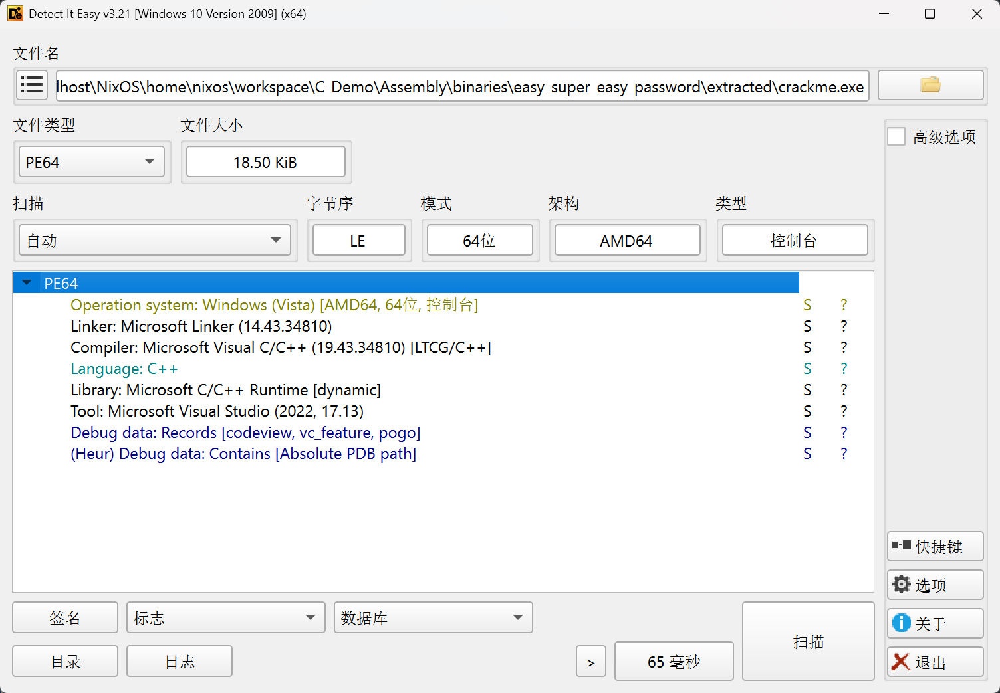

IDA 打开后进入 Strings 窗口，定位到以下关键字符串：

```text
Enter the password:
hello
Access granted!
Access denied!
```

图 1-2 中的 `Enter the password:`、`hello`、`Access granted!` 和 `Access denied!` 基本覆盖了输入提示、目标口令和两个输出分支，是定位校验逻辑的入口。

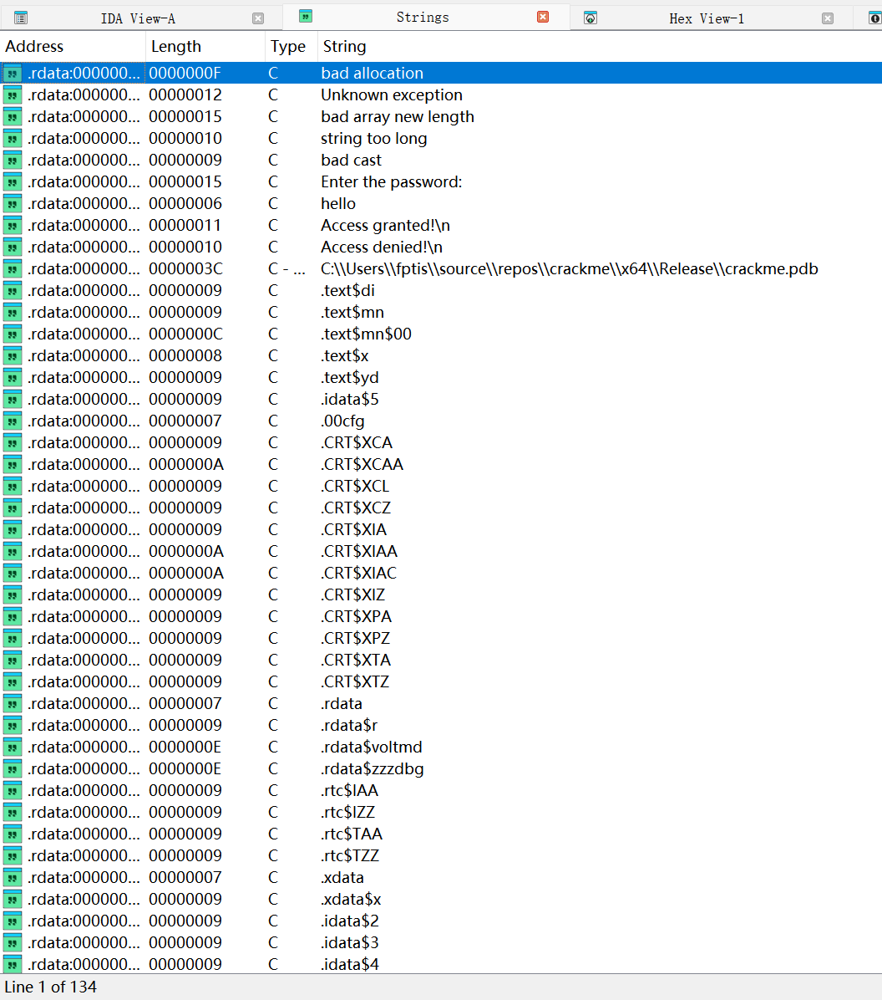

从 `Enter the password:` 和 `hello` 的交叉引用跳转到主校验函数 `sub_1400012A0`。图 1-3 展示了字符串交叉引用位置，可以看到这些字符串集中被主校验流程使用，而不是分散在无关函数中。

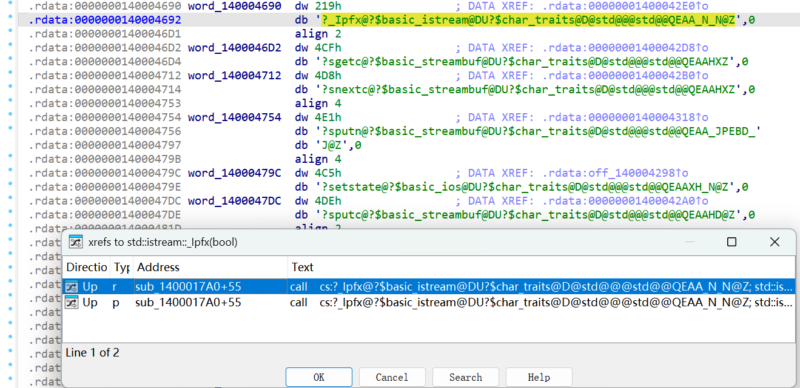

关键判断位置如下：

- `0x140001326`：判断输入长度是否为 5。
- `0x140001331` 到 `0x140001342`：逐字节比较输入和常量 `hello`。
- `0x14000134F`：根据比较结果跳转成功或失败分支。
- `0x140001351`：失败分支。
- `0x1400013A1`：成功分支。

核心汇编：

```asm
cmp     qword ptr [rsp+30h], 5
jne     loc_140001351

loc_140001331:
movzx   ecx, byte ptr [rdx+rax]
inc     rax
cmp     cl, byte ptr [rsi+rax-1]
jne     loc_140001348
cmp     rax, 5
jne     loc_140001331

test    eax, eax
je      loc_1400013A1
```

图 1-4 对应长度判断和逐字节比较逻辑。这里先用 `cmp [rsp+30h], 5` 判断输入长度，再进入循环与常量 `hello` 比较，因此只要长度不为 5 会直接失败。

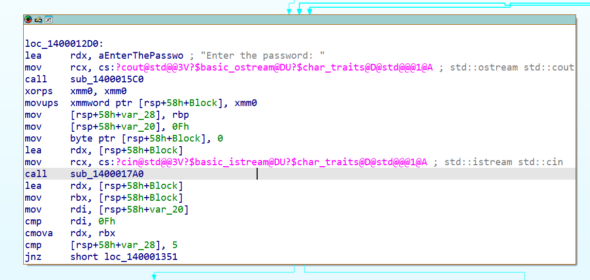

图 1-5 是 IDA 伪代码视角，能够更直观地看到程序的核心逻辑就是“长度等于 5 且内容等于 `hello`”。

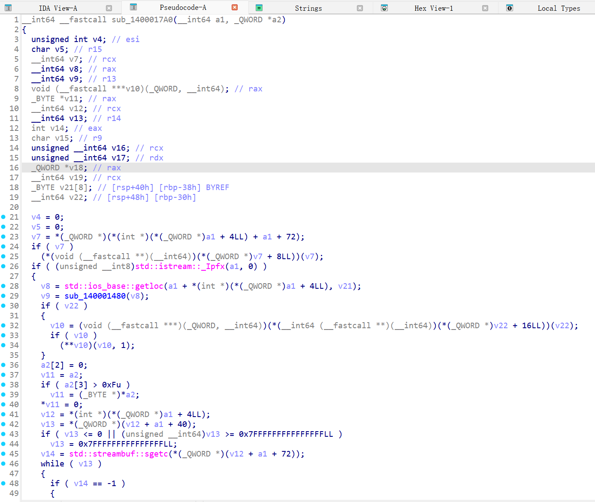

## 4. 动态调试（断点 + 寄存器）

x64dbg 中设置断点：

| 断点 | 目的 |
| --- | --- |
| `0x140001326` | 观察输入长度判断 |
| `0x140001338` | 观察逐字节比较 |
| `0x14000134F` | 观察最终成功/失败分支 |

关键寄存器和内存：

- `rdx`：输入字符串缓冲区。
- `rsi`：常量字符串 `hello` 地址。
- `rax`：比较循环下标。
- `cl`：当前输入字符。
- `[rsp+30h]`：输入长度。

动态验证时，输入 `hell` 会在长度判断处失败；输入 `hello` 时逐字节比较均相等，最终进入成功分支。

图 1-6 使用错误输入命中长度判断断点，可以观察到输入长度没有满足 `5` 的要求，程序随后进入失败路径。

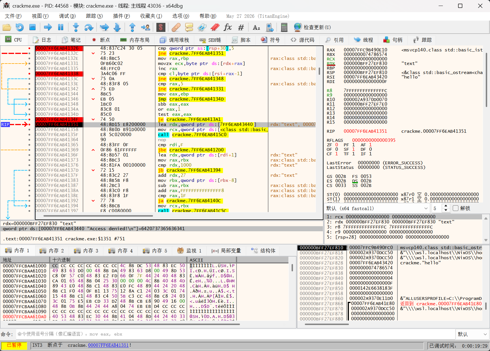

图 1-7 在逐字节比较处观察输入缓冲区和常量字符串 `hello`，寄存器中的当前字符会随循环逐个比较。

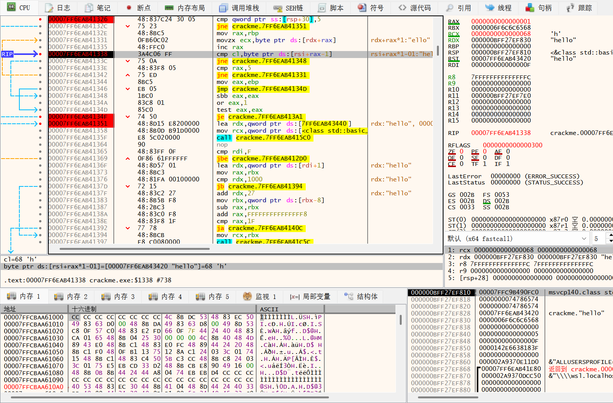

图 1-8 输入完整的 `hello` 后，所有比较通过，执行流进入成功分支并输出 `Access granted!`。

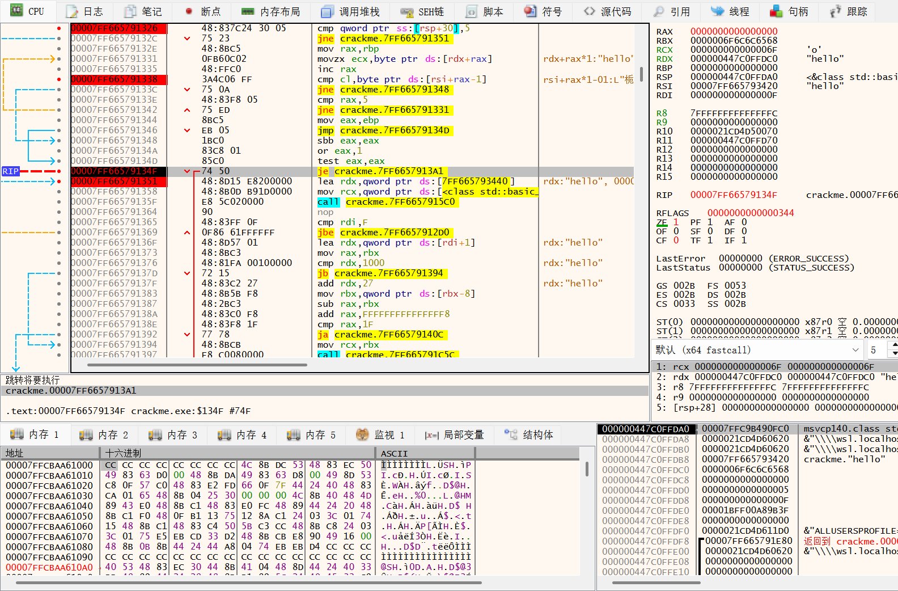

## 5. 核心算法（伪代码）

```c
bool check_password(string input) {
    const char *password = "hello";

    if (input.length() != 5) {
        return false;
    }

    for (int i = 0; i < 5; i++) {
        if (input[i] != password[i]) {
            return false;
        }
    }

    return true;
}
```

## 6. 解决方案

静态分析直接得到固定密码为：

```text
hello
```

为便于复核，实现验证脚本：

```text
Assembly/scripts/easy_verify.py
```

运行方式：

```bash
python3 Assembly/scripts/easy_verify.py test hell hello
```

## 7. 验证结果

| 编号 | 输入 | 程序结果 | 结论 |
| --- | --- | --- | --- |
| 1 | `test` | `Access denied!` | 长度不为 5，失败 |
| 2 | `hell` | `Access denied!` | 长度不为 5，失败 |
| 3 | `hello` | `Access granted!` | 正确密码，通过 |

## 8. 难度分析

本题难度较低，核心是字符串定位和条件跳转判断。需要注意的是，C++ `std::string` 相关清理逻辑会干扰阅读，不能把字符串释放或小字符串优化判断误认为密码逻辑。整体耗时约 1 小时以内。

---

# 二、中等难度题：KeygenMe_3_SWD

## 1. 题目信息

- 来源：https://crackmes.one/crackme/69fa884dd7ff92e1214c0024
- 难度：3.0 / Medium
- 文件名：`KeygenMe_3_SWD.exe`
- 本地路径：`Assembly/binaries/medium_keygenme_3_swd/extracted/KeygenMe_3_SWD.exe`
- SHA256：`73758bc4a5fa71719bf031122c903feadfd7d5094bda87d997e3591937463958`
- 平台：Windows PE32+ / x86-64 console
- 工具：Detect It Easy、IDA、x64dbg、Python

## 2. 程序功能分析

程序是 KeygenMe 类型题目，依次要求输入：

```text
Username:
Secret code:
Verification PIN:
```

程序先校验输入格式，再根据用户名计算 Secret code 和 Verification PIN 的期望值。若两项均正确，则对应验证结果通过。题目重点从固定密码转为算法还原和 Keygen 实现。

## 3. 静态分析

先用 DIE 确认样本属性。图 2-1 显示该程序同样是 Windows x64 控制台程序，适合继续使用 IDA 和 x64dbg 分析。

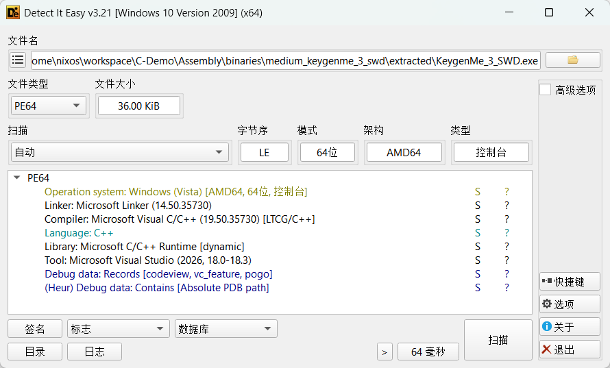

IDA Strings 窗口中确认关键字符串：

```text
0123456789ABCDEFGHIJKLMNOPQRSTUVWXYZ
KeygenMe No 3
Username:
Secret code:
Verification PIN:
```

图 2-2 中的字符表 `0123456789ABCDEFGHIJKLMNOPQRSTUVWXYZ` 是后续 base36 编码的关键线索；`Username:`、`Secret code:` 和 `Verification PIN:` 则对应程序的三段输入流程。

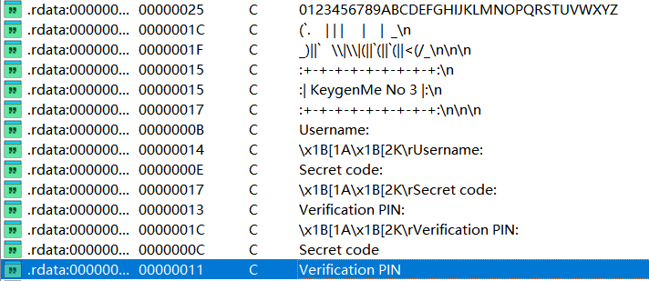

主流程位于 `0x140002BD0` 附近。关键函数：

| 地址 | 功能 |
| --- | --- |
| `0x140001E30` | Username 格式校验 |
| `0x140001EC0` | Secret code 格式校验 |
| `0x140001F80` | PIN 格式校验和整数转换 |
| `0x140001FF0` | base36 字符串转整数 |
| `0x140002100` | Secret code 核心校验 |
| `0x1400025A0` | PIN 候选值生成 |
| `0x140002910` | PIN 比较 |
| `0x1400020A0` | 32 位循环左移 |
| `0x1400020D0` | 32 位循环右移 |

图 2-3 展示了主交互流程：程序依次读取 Username、Secret code 和 Verification PIN，然后分别调用校验函数。这个位置适合建立整体调用关系。


Secret code 格式为：

```text
XXXX-XXXXX-XXX
```

程序将用户名转成大写后参与计算。`0x140002300` 到 `0x140002399` 是用户名遍历循环，计算加权和、异或混合和乘法取模。`0x1400026C9` 到 `0x140002808` 是 PIN 哈希循环，包含 `rol32`、`ror32`、异或、加法和乘法混合。

图 2-4 是 Secret code 的用户名遍历循环。这里可以看到每个字符都会按位置参与加权和、异或和乘法取模，说明 Secret code 不是固定字符串，而是由 Username 派生。

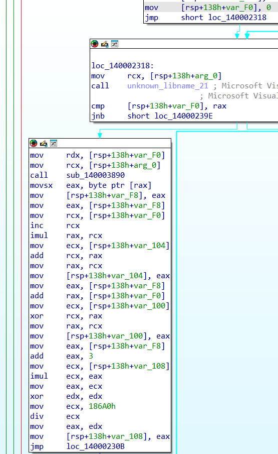

图 2-5 对应 Secret code 的三段比较逻辑。程序把输入按 `XXXX-XXXXX-XXX` 拆分为三段，并分别与计算结果比较。

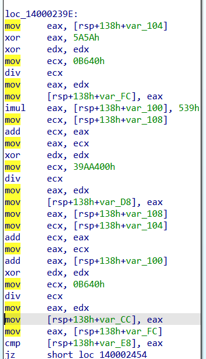

图 2-6 是 PIN 哈希混合循环，能看到循环移位、异或、加法和乘法混合操作。该部分把 Username 和 Secret code 进一步混合为 PIN 候选值。

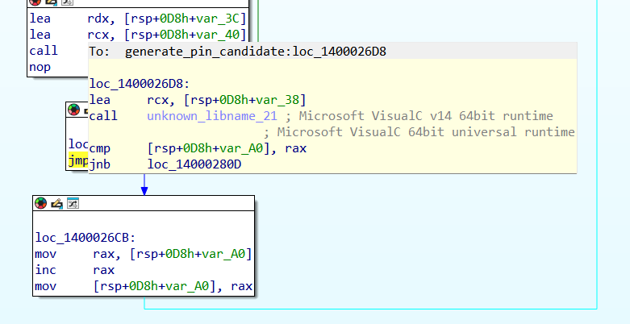

图 2-7 是 PIN 最终比较逻辑。程序将输入的整数 PIN 与计算出的候选值比较，返回值决定最终验证结果。

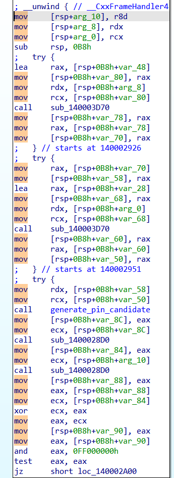

## 4. 动态调试

x64dbg 中使用脚本生成一组合法输入，例如：

```text
Username: Alice
Secret code: 0IMB-040EG-YZL
Verification PIN: 775865310
```

建议断点：

| 断点 | 目的 |
| --- | --- |
| `keygenme_3_swd.exe:$2DD9` | 调用 Secret code 校验前 |
| `keygenme_3_swd.exe:$2DDE` | Secret code 校验返回后 |
| `keygenme_3_swd.exe:$2FAE` | 调用 PIN 校验前 |
| `keygenme_3_swd.exe:$2FB3` | PIN 校验返回后 |

关键观察：

- `EAX` / `AL`：校验函数返回值，非零表示通过。
- `RCX`、`RDX`、`R8`：Windows x64 调用约定下传入 Username、Secret code、PIN 等参数。
- 栈上局部变量保存 Secret code 分段值和 PIN 整数。

图 2-8 停在 Secret code 校验调用前，可以确认参数已经按 Windows x64 调用约定放入寄存器或栈上，便于核对脚本生成结果。

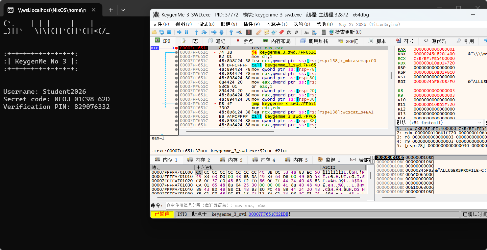

图 2-9 是 Secret code 校验返回后的位置，`AL` 为通过状态，说明脚本生成的 `0IMB-040EG-YZL` 与程序内部算法一致。

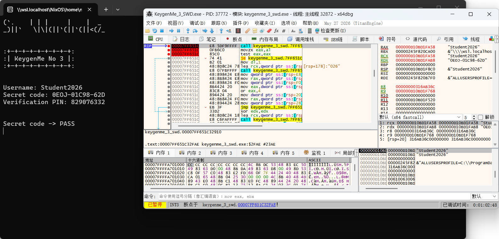

图 2-10 停在 PIN 校验调用前，用来观察输入 PIN 与前面通过的 Secret code 是否一同传入 PIN 校验函数。

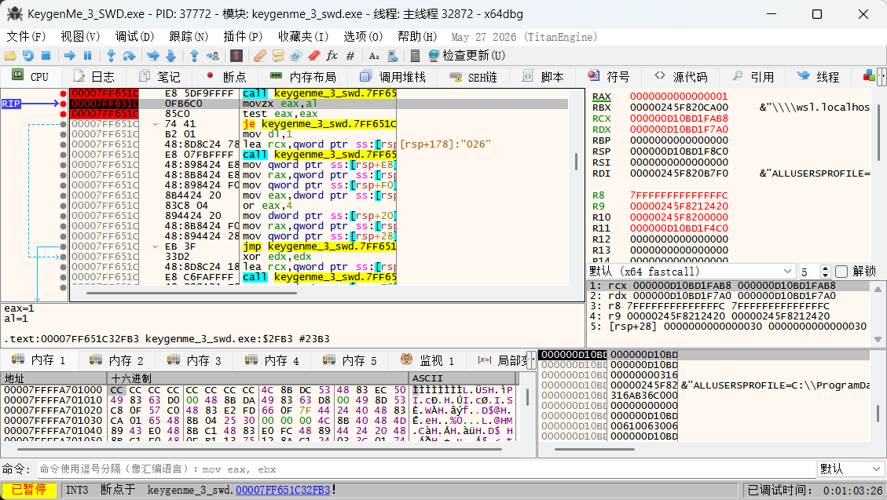

图 2-11 显示 PIN 校验返回通过，证明还原出的哈希混合算法可以生成合法 Verification PIN。

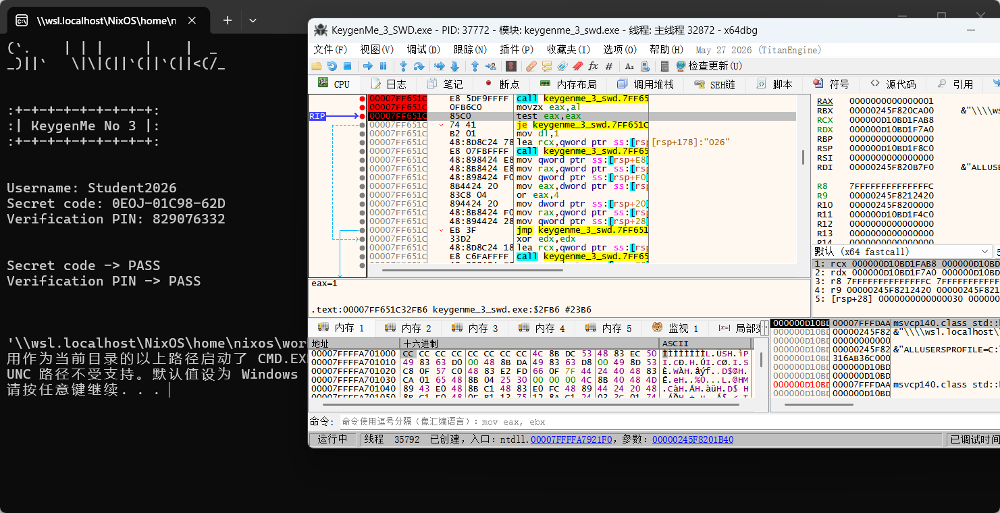

## 5. 核心算法（伪代码）

Secret code 生成：

```c
username = uppercase(username);

uint32_t sum_weighted = 0;
uint32_t xor_mix = 0;
uint32_t product_mix = 1;

for (size_t i = 0; i < username.length(); i++) {
    uint32_t ch = username[i];
    sum_weighted += ch * (i + 1);
    xor_mix ^= ch + i;
    product_mix = (product_mix * (ch + 3)) % 100000;
}

part1 = (sum_weighted ^ 0x5A5A) % 46656;
part2 = (xor_mix * 1337 + product_mix) % 60466176;
part3 = (product_mix + sum_weighted + xor_mix) % 46656;

secret_code = base36(part1, 4) + "-" +
              base36(part2, 5) + "-" +
              base36(part3, 3);
```

PIN 生成：

```c
uint32_t a = 0xA3B1C2D3;
uint32_t b = 0x1F2E3D4C;
string material = uppercase(username) + char(secret_code.length() ^ 0x5A) + secret_code;

for (size_t i = 0; i < material.length(); i++) {
    uint32_t ch = material[i];
    a ^= ch + i * 0x11;
    a = rol32(a, i % 5 + 3);
    a += b ^ 0x9E3779B9;
    b ^= a + ch * 0x83;
    b = ror32(b, i % 7 + 2);
    b += (a << 3) ^ 0x7F4A7C15;
    if (i & 1) swap(a, b);
}

uint32_t pin = a ^ b;
pin ^= pin >> 16;
pin *= 0x85EBCA6B;
pin ^= pin >> 13;
pin *= 0xC2B2AE35;
pin ^= pin >> 16;
pin &= 0x7FFFFFFF;
```

## 6. 解决方案

实现 Keygen：

```text
Assembly/scripts/medium_keygen.py
```

运行示例：

```bash
python3 Assembly/scripts/medium_keygen.py Alice
```

输出：

```text
Username: Alice
Secret code: 0IMB-040EG-YZL
Verification PIN: 775865310
Self-check: ok
```

## 7. 验证结果

| 编号 | Username | Secret code | Verification PIN | 结论 |
| --- | --- | --- | --- | --- |
| 1 | `abc` | `0I50-02N6V-MB1` | `1846922373` | 最短合法长度边界，通过 |
| 2 | `Alice` | `0IMB-040EG-YZL` | `775865310` | 普通字母用户名，通过 |
| 3 | `Student2026` | `0EOJ-01C98-62D` | `829076332` | 字母数字混合用户名，通过 |

图 2-12 到图 2-14 分别对应三组输入。三组 Username 覆盖短字符串、普通字母和字母数字混合情况，均能通过程序验证。

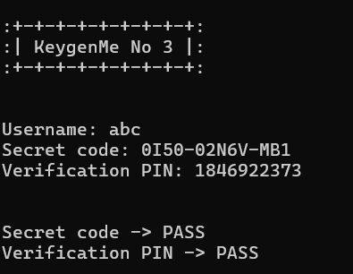

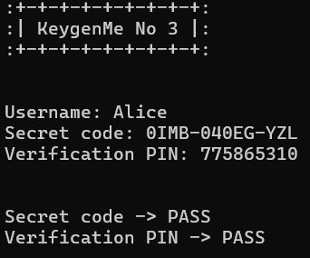

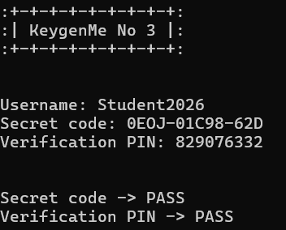

## 8. 难度分析

本题难度中等。相比 Easy 题，Medium 题需要还原多个函数之间的数据流，并把 IDA 中的汇编逻辑复现为可运行 Keygen。主要难点是 base36 编码、用户名大写化、Secret code 三段取模、PIN 的循环移位混合。整体耗时约 2 到 3 小时。

---

# 三、高难度题：Intermediate Anti-Debug and Runtime Dynamic Password Challenge

## 1. 题目信息

- 来源：https://crackmes.one/crackme/68f3c25b2d267f28f69b76a6
- 难度：5.0 / Hard
- 文件名：`crackme.exe`
- 本地路径：`Assembly/binaries/hard_antidebug_runtime_password/extracted/crackme.exe`
- SHA256：`0fab24ee3a3ca60296259a895db01d67185b129cfa44e9c615bc02928352ab6a`
- 平台：Windows PE32 / x86 console
- ImageBase：`0x00400000`
- EntryPoint：`0x004012E0`
- 工具：Detect It Easy、IDA、x32dbg、Python、MSYS2

## 2. 程序功能分析

程序提示输入整数口令：

```text
Enter The INT password:
```

输入错误会输出：

```text
Incorrect Password Try Again:
```

输入正确会输出：

```text
Congrats!
```

本题重点是反调试。直接用 x32dbg 打开会出现“调试结束”或快速退出。排查发现，一部分问题来自 MinGW 32 位运行库缺失，另一部分来自程序自身的反调试检测。

## 3. 静态分析

先用 DIE 查看样本基础信息。图 3-1 显示该文件是 PE32 x86 程序，这一点直接影响后面的运行库选择和调试器选择：应使用 32 位 DLL 和 x32dbg。

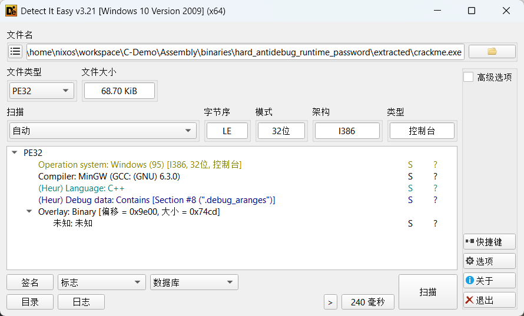

IDA Strings 窗口中可以定位到输入提示和成功、失败字符串。图 3-2 说明程序的明面功能仍然是整数口令校验，但动态调试前必须先处理反调试逻辑。

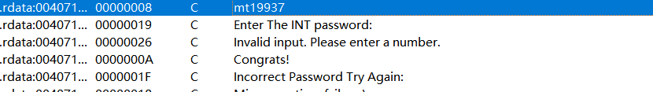

导入表和字符串分析确认关键 API：

```text
IsDebuggerPresent
GetTickCount
Sleep
GetCurrentProcessId
SetUnhandledExceptionFilter
VirtualQuery
VirtualProtect
```

图 3-3 中的 `IsDebuggerPresent`、`GetTickCount`、`Sleep`、`VirtualProtect` 等 API 表明样本不仅会检测调试器，还可能通过延时、内存权限修改或异常处理干扰调试流程。

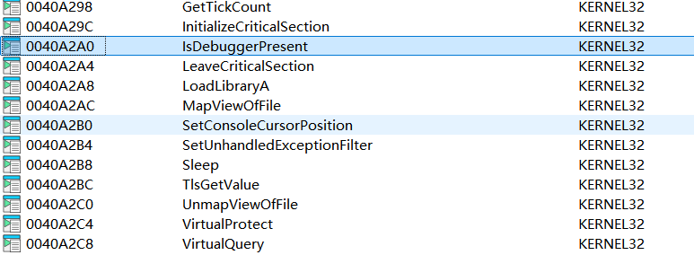

关键函数：

| 地址 | 功能 |
| --- | --- |
| `0x401F57` | main |
| `0x401E9A` | checkDebugger |
| `0x40155A` | CheckNtGlobalFlag |
| `0x4017AB` | CheckGlobalFlagsClearInProcess |
| `0x40183F` | CheckGlobalFlagsClearInFile |
| `0x401AB0` | SpawnDecoy |
| `0x401460` | GetPEB |

TLS callback：

```text
0x402D00
0x402CB0
```

图 3-4 是 `IsDebuggerPresent` 的交叉引用，可以看到反调试检测不是孤立调用，而是被多个位置复用。

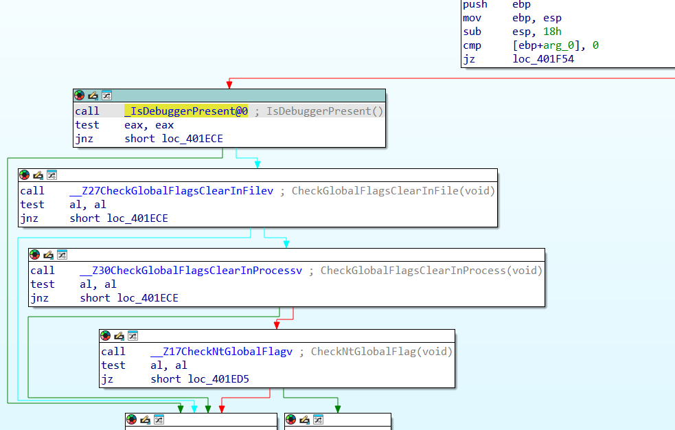

主流程多次调用 `checkDebugger`：

```text
0x402018 -> 0x401E9A
0x4021AD -> 0x401E9A
0x402372 -> 0x401E9A
0x40258C -> 0x401E9A
```

图 3-5 是 `checkDebugger` 函数主体，内部组合了 API 检测和 PEB/NtGlobalFlag 相关检测。该函数返回非零时，主流程会转入退出或干扰路径。

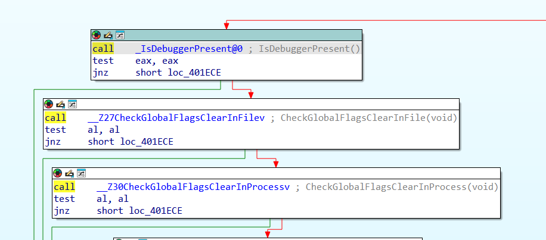

此外，`0x402394` 附近还有内联反调试逻辑。因此不能只 patch 一个 API 或一个函数。图 3-6 展示了 main 中的反调试循环和分支，说明主流程中还存在独立于 `checkDebugger` 的检测点。

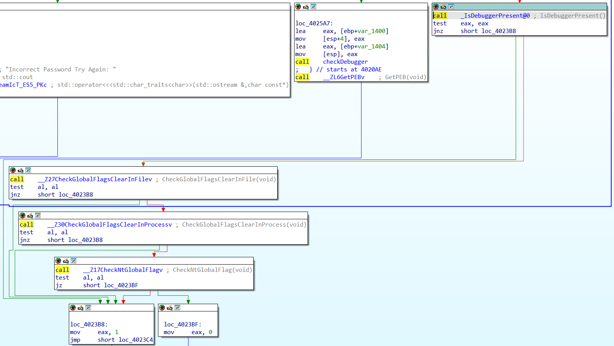

## 4. 动态调试

环境排查：

- `0xC0000135`：缺少 32 位 MinGW DLL。
- `0xC000007B`：DLL 位数错误。

最终补齐：

```text
libgcc_s_dw2-1.dll
libstdc++-6.dll
libwinpthread-1.dll
```

DLL 来自：

```text
C:\msys64\mingw32\bin\
```

动态调试采用辅助脚本创建挂起进程：

```text
Assembly/scripts/hard_launch_for_attach.py
```

脚本使用 `CreateProcessW` + `CREATE_SUSPENDED` 创建进程，使样本出现在 x32dbg 的 Attach 列表中。恢复主线程前，脚本用 `WriteProcessMemory` patch 反调试检测。

观察断点：

| 断点 | 目的 |
| --- | --- |
| `0x402D00` | TLS callback |
| `0x402CB0` | TLS callback |
| `0x4012E0` | 程序入口点 |
| `0x401F57` | main |
| `0x401E9A` | checkDebugger |
| `0x4023B8` | 内联 detected 结果 |

关键寄存器：

- `EAX` / `AL`：反调试检测返回值，非零表示 detected。
- `EIP`：观察是否进入退出路径。

图 3-7 是附加后的模块状态，可以确认补齐 DLL 后样本能够正常加载，前面的 `0xC0000135` 和 `0xC000007B` 已经不再阻塞调试。

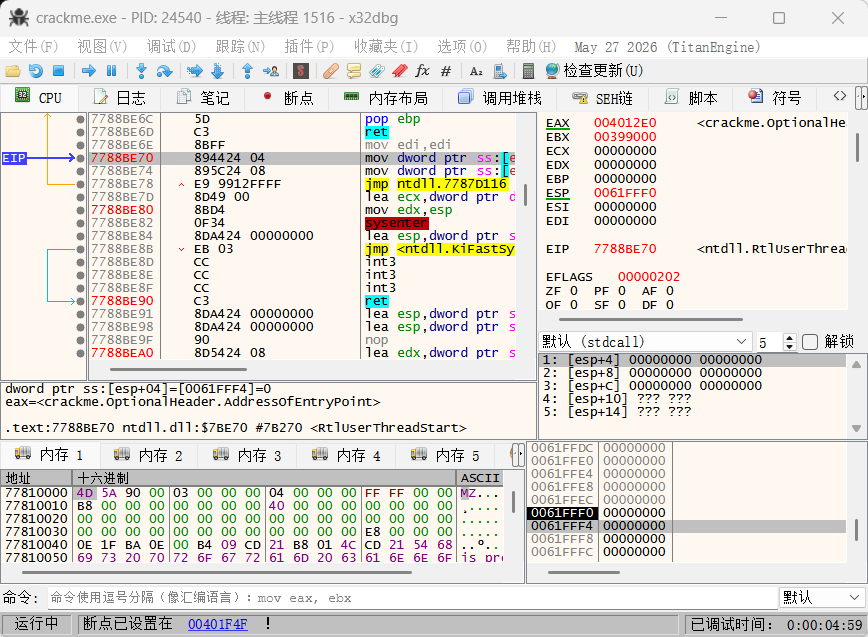

图 3-8 展示关键断点设置情况，覆盖 TLS callback、入口点、main、`checkDebugger` 和内联检测位置，便于分阶段确认执行流。

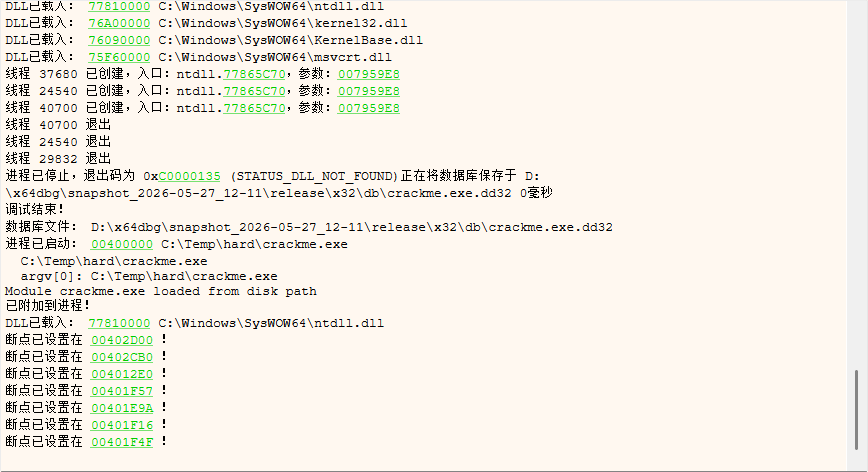

图 3-9 命中入口点 `int3`，说明挂起进程加 attach 的方式能够在主流程执行前获得控制权。

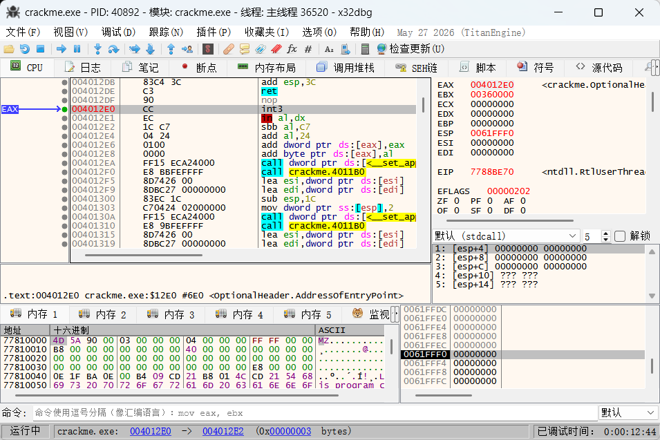

图 3-10 恢复入口点原始指令，避免临时断点本身破坏程序继续执行。

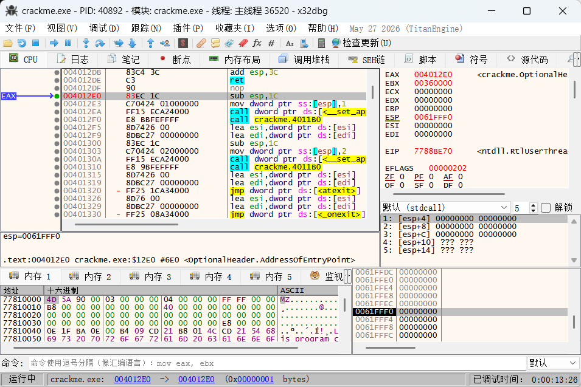

图 3-11 是 `checkDebugger` patch 后的状态。通过让该函数直接返回 0，可以绕过多处复用的反调试检查。

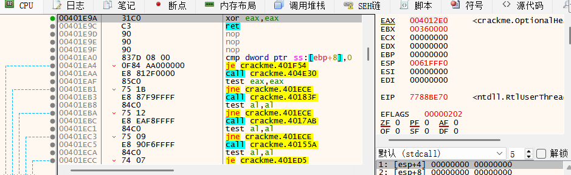

图 3-12 显示程序已经进入 `Enter The INT password:` 输入提示，说明运行库问题和反调试拦截都已处理完毕，动态分析可以继续进行。

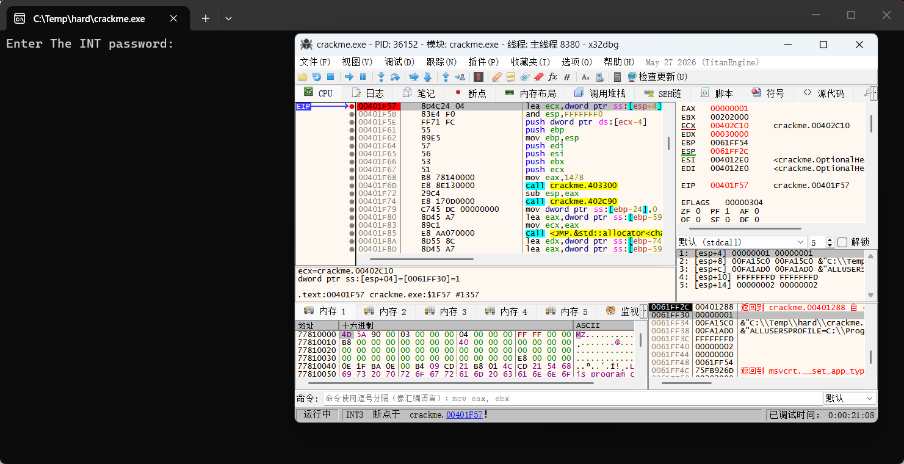

## 5. 核心算法（伪代码）

本题本阶段的核心分析对象是反调试流程。`checkDebugger` 逻辑可还原为：

```c
bool checkDebugger(void) {
    if (IsDebuggerPresent()) {
        return true;
    }
    if (CheckGlobalFlagsClearInFile()) {
        return true;
    }
    if (CheckGlobalFlagsClearInProcess()) {
        return true;
    }
    if (CheckNtGlobalFlag()) {
        return true;
    }
    return false;
}
```

检测到调试器后的处理：

```c
if (checkDebugger()) {
    Sleep(random_delay);
    SpawnDecoy();
    ExitProcess(0);
}
```

内联检测流程：

```c
detected = false;
if (IsDebuggerPresent()) detected = true;
if (CheckGlobalFlagsClearInFile()) detected = true;
if (CheckGlobalFlagsClearInProcess()) detected = true;
if (CheckNtGlobalFlag()) detected = true;

if (detected) {
    enter_decoy_or_exit_path();
}
```

对应 patch：

```asm
401E9A  xor eax, eax
401E9C  ret
4023B8  mov eax, 0
```

## 6. 解决方案

步骤：

1. 将样本和脚本放入 `C:\Temp\hard\`。
2. 使用 MSYS2 MINGW32 安装运行库：

```bash
pacman -S mingw-w64-i686-gcc-libs
```

3. 复制 32 位 DLL：

```powershell
copy C:\msys64\mingw32\bin\libgcc_s_dw2-1.dll C:\Temp\hard\
copy C:\msys64\mingw32\bin\libstdc++-6.dll C:\Temp\hard\
copy C:\msys64\mingw32\bin\libwinpthread-1.dll C:\Temp\hard\
```

4. 运行挂起进程脚本：

```powershell
cd C:\Temp\hard
python .\hard_launch_for_attach.py
```

5. x32dbg 选择 `File -> Attach`，附加脚本输出的 PID。
6. 回到 PowerShell 按回车恢复主线程。
7. 程序进入 `Enter The INT password:`，说明反调试绕过成功。

## 7. 验证结果

| 编号 | 操作 | 结果 | 结论 |
| --- | --- | --- | --- |
| 1 | 未补运行库直接启动 | `0xC0000135` | 确认缺少 DLL |
| 2 | 使用错误位数 DLL | `0xC000007B` | 确认必须使用 32 位 DLL |
| 3 | 补齐 DLL 并执行挂起附加脚本 | 出现 `Enter The INT password:` | 反调试绕过成功 |

## 8. 难度分析

本题难度最高。难点不是单纯找密码，而是先解决动态调试无法稳定进入主流程的问题。样本同时使用 TLS callback、API 检测、PEB/NtGlobalFlag 检测、内联检测和退出路径。分析时需要区分环境错误和反调试行为，否则容易把 DLL 缺失误判为保护逻辑。整体耗时约 3 到 4 小时。

---

# 四、综合分析

## 1. 难度差异

| 题目 | 难度 | 主要原因 |
| --- | --- | --- |
| Easy | 低 | 固定字符串比较，直接从 Strings 和交叉引用定位 |
| Medium | 中 | 多函数算法还原，需要实现 Keygen |
| Hard | 高 | 运行环境、TLS、反调试、内联检测共同影响动态调试 |

Easy 题主要考察基础静态分析；Medium 题要求把汇编逻辑转为可执行算法；Hard 题重点是动态调试对抗，需要先恢复可调试状态。

## 2. 技术点差异

| 题目 | 技术点 |
| --- | --- |
| Easy | 字符串定位、长度判断、逐字节比较、条件跳转 |
| Medium | base36、大小写归一化、哈希混合、循环移位、Keygen |
| Hard | PE32 依赖、TLS callback、`IsDebuggerPresent`、PEB 标志、挂起进程、内存 patch |

## 3. 分析方法差异

Easy 题从字符串交叉引用直接进入校验函数，动态调试只用于验证。Medium 题先静态还原算法，再用 Python 脚本复现，最后动态验证返回值。Hard 题先排查运行环境，再用挂起进程和 attach 方式避开启动阶段干扰，最后通过内存 patch 验证反调试绕过。

## 4. 时间成本

| 阶段 | Easy | Medium | Hard |
| --- | --- | --- | --- |
| 环境准备 | 低 | 中 | 高 |
| 静态分析 | 低 | 高 | 中 |
| 动态调试 | 低 | 中 | 高 |
| 脚本实现 | 低 | 中 | 中 |
| 总耗时估计 | 1 小时以内 | 2 到 3 小时 | 3 到 4 小时 |

---

# 五、个人分工与总结

## 1. 个人分工

| 姓名 | 学号 | 分工 |
| --- | --- | --- |
| 刘宁 |  | 静态分析、样本信息整理、IDA 字符串与交叉引用定位、关键函数命名、汇编逻辑还原、伪代码和报告整理 |
| 赵旭 |  | 动态调试与验证、x64dbg/x32dbg 断点设置、寄存器和内存观察、运行截图采集、Hard 题反调试附加流程调试 |

- 三个题目均由两名组员共同参与，没有按题目完全拆分。
- 组员 A 主要负责每个题目的静态分析：样本信息整理、DIE/IDA 识别、字符串和交叉引用定位、关键函数命名、汇编逻辑还原、伪代码整理。
- 组员 B 主要负责每个题目的动态调试与验证：x64dbg/x32dbg 断点设置、寄存器和内存观察、运行截图采集、验证用例执行、Hard 题反调试附加流程调试。
- 代码实现共同完成：A 侧重 Easy 验证脚本和 Medium Keygen 算法复现，B 侧重 Hard 挂起进程附加和内存 patch 脚本验证。
- 报告整理共同完成：A 侧重静态分析和算法描述，B 侧重动态调试、截图说明和验证结果复核。

## 2. 个人总结

本次实验从固定密码、Keygen 到反调试逐步提高复杂度。组员 A 在三题中主要承担静态分析和算法还原工作，重点是从字符串、交叉引用和函数调用关系中抽取核心逻辑，并整理为伪代码和脚本实现。通过三题对比可以看到，静态分析需要和动态验证相互印证，单独依赖任一方法都容易遗漏关键条件。
