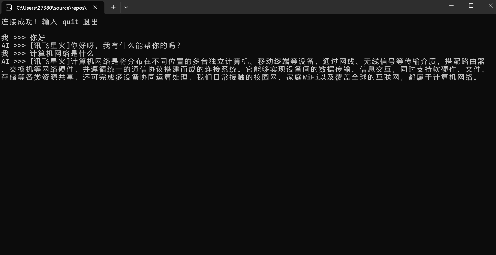

# 题目一：AI 智能问答聊天工具

## 目录

- 摘要
- 第 1 章 引言
- 第 2 章 系统设计
- 第 3 章 五层体系结构原理分析与验证
- 第 4 章 AI 集成实现
- 第 5 章 系统测试与验证
- 第 6 章 总结与展望

## 摘要

本题目面向课程设计中的 AI 智能问答聊天工具，设计一个基于 TCP Socket 的 C/S 架构聊天系统。系统由多个客户端和一个中心服务器组成，服务器负责接收客户端连接、维护在线用户、转发聊天消息，并在收到 AI 问答请求时调用大模型 API 或本地模拟接口生成回复。为了处理 TCP 面向字节流带来的消息边界问题，系统设计了基于“固定长度头部 + JSON 消息体”的自定义应用层协议，使接收端能够明确判断消息类型和消息长度，从而解决粘包、半包问题。通过 Wireshark 抓包与分层字段分析，可以说明一次聊天消息从应用层生成，到被 TCP、IP、Ethernet 逐层封装并在对端解封装的全过程。

关键词：TCP Socket；C/S 架构；多线程；AI 问答；自定义协议；粘包；Wireshark；五层体系结构

## 第 1 章 引言

### 1.1 选题目标

AI 智能问答聊天工具的目标是实现一个能够支持多客户端接入的 TCP 聊天系统，并在服务器端集成 AI 大模型能力。当客户端发送普通聊天消息时，服务器负责转发；当客户端发送自然语言问题时，服务器调用 AI API 获取回答，再将回答返回给发起用户或广播到指定聊天室。

题目重点不是简单地收发字符串，而是通过一个完整的 Socket 应用理解 TCP 通信过程、并发处理、应用层协议设计和粘包处理。系统需要能够解释一次聊天消息在应用层、传输层、网络层、链路层和物理层中的封装与解封装过程。

### 1.2 设计内容

项目完成内容如下：

1. 使用 TCP Socket 实现客户端与服务器通信。
2. 服务器支持多个客户端同时连接。
3. 客户端支持发送普通聊天消息、AI 问答请求和退出指令。
4. 服务器根据消息类型进行转发、AI 调用或连接释放。
5. 设计自定义应用层协议，区分消息类型、发送者、接收范围、请求编号和正文内容。
6. 使用 4 字节长度前缀解决 TCP 粘包和半包问题。
7. AI 模块封装为独立适配器，支持真实 API 和无密钥演示模式。
8. 支持连接超时、异常断开和 API 调用失败提示。
9. 通过 Wireshark 分析 TCP 三次握手、聊天数据传输和连接释放过程。
10. 在报告中说明一次聊天消息的五层封装与解封装过程。

### 1.3 开发环境与工具

| 项目 | 内容 |
| --- | --- |
| 开发语言 | Python 3 |
| 网络通信 | TCP Socket |
| 并发模型 | 多线程或线程池 |
| 应用层数据格式 | JSON |
| 消息定界方式 | 4 字节大端长度前缀 + JSON 消息体 |
| AI 接入方式 | DeepSeek、文心一言、讯飞星火等 HTTP API，或本地模拟回复 |
| 抓包工具 | Wireshark |
| 验证重点 | 多客户端通信、AI 回复、自定义协议、TCP 粘包、五层封装 |

## 第 2 章 系统设计

### 2.1 总体架构

系统整体架构如下：

```text
客户端 A / 客户端 B / 客户端 C
        |
        v
TCP Socket 长连接
        |
        v
服务器连接管理模块
        |
        v
自定义协议编解码模块
        |
        v
消息分发模块
普通聊天 / 私聊 / 群聊 / AI 问答 / 退出
        |
        v
AI API 适配器 + 聊天记录模块
        |
        v
服务器回复或转发给目标客户端
```

客户端负责读取用户输入、封装协议消息、发送给服务器，并持续接收服务器返回的普通聊天消息或 AI 回复。服务器负责监听端口、接收客户端连接、为每个客户端创建处理线程，并把收到的应用层消息交给消息分发模块处理。

### 2.2 功能模块划分

#### 2.2.1 客户端模块

客户端主要功能如下：

1. 连接服务器指定 IP 和端口。
2. 输入用户名并发送登录消息。
3. 读取用户输入，判断是普通聊天、AI 问答、私聊还是退出指令。
4. 将用户输入封装成自定义协议消息。
5. 使用独立接收线程持续接收服务器推送。
6. 当用户输入退出指令时发送 `exit` 消息并关闭连接。

客户端命令示例：

```bash
python client.py --host 127.0.0.1 --port 9000 --name alice
```

#### 2.2.2 服务器连接管理模块

服务器主要功能如下：

1. 在固定端口监听 TCP 连接。
2. 每接入一个客户端，就创建线程或提交到线程池处理。
3. 保存在线用户与 Socket 的映射关系。
4. 处理客户端异常断开、主动退出和超时。
5. 对共享在线用户表加锁，避免多线程读写冲突。

服务器命令示例：

```bash
python server.py --host 0.0.0.0 --port 9000
```

连接管理流程如下：

```text
socket()
  -> bind()
  -> listen()
  -> accept()
  -> 创建客户端处理线程
  -> recv 协议帧
  -> 分发消息
  -> send 回复
  -> close()
```

#### 2.2.3 自定义应用层协议

TCP 只保证字节流可靠、有序到达，不保留应用层发送时的消息边界。如果直接使用 `recv()` 读取字符串，可能一次读到半条消息，也可能一次读到多条消息，这就是常见的粘包和半包问题。

本系统采用如下协议格式：

```text
4 字节消息体长度 | JSON 消息体
```

其中长度字段使用网络字节序大端整数，表示后续 JSON 消息体的字节数。JSON 消息体使用 UTF-8 编码。

消息字段设计如下：

| 字段 | 含义 |
| --- | --- |
| type | 消息类型，例如 login、chat、ai_question、ai_answer、private、file_meta、exit、error |
| sender | 发送者用户名 |
| target | 接收者或聊天室名称 |
| request_id | 请求编号，用于匹配 AI 问答请求和响应 |
| timestamp | 发送时间 |
| payload | 消息正文 |
| meta | 可选元数据，例如文件名、文件大小、模型名称 |

普通聊天消息示例：

```json
{
  "type": "chat",
  "sender": "alice",
  "target": "room",
  "request_id": "msg-001",
  "timestamp": 1710000000.123,
  "payload": "大家好",
  "meta": {}
}
```

AI 问答请求示例：

```json
{
  "type": "ai_question",
  "sender": "alice",
  "target": "server",
  "request_id": "ai-001",
  "timestamp": 1710000005.456,
  "payload": "请解释 TCP 三次握手",
  "meta": {
    "model": "default"
  }
}
```

#### 2.2.4 粘包处理模块

接收端按如下流程处理 TCP 字节流：

```text
先循环读取 4 字节长度字段
  -> 将长度字段解析为整数 body_len
  -> 检查 body_len 是否超过最大允许长度
  -> 循环读取 body_len 字节 JSON 消息体
  -> UTF-8 解码
  -> JSON 解析
  -> 按 type 字段分发处理
```

这种方式能够处理以下情况：

1. 一条消息被拆成多个 TCP 段到达。
2. 多条短消息被合并到同一次 `recv()` 返回。
3. 网络较慢导致消息体分批到达。
4. 客户端异常断开导致消息未接收完整。

为了避免恶意客户端发送超大长度字段，服务器应设置单条消息最大长度，例如 1 MB。超过限制时直接返回错误并关闭连接。

#### 2.2.5 消息分发模块

消息分发规则如下：

| 消息类型 | 处理方式 |
| --- | --- |
| login | 注册用户名，加入在线用户表 |
| chat | 广播到聊天室内所有用户 |
| private | 转发给指定用户 |
| ai_question | 调用 AI 模块并返回 `ai_answer` |
| file_meta | 通知文件传输元信息 |
| exit | 从在线用户表移除并关闭连接 |
| error | 返回错误提示 |

普通群聊消息由服务器直接广播；私聊消息只转发给 `target` 指定的用户；AI 问答请求交给 AI 模块处理后，服务器将结果封装为 `ai_answer` 返回。

### 2.3 应用层协议与 TCP 粘包说明

本题目的应用层协议是课程设计重点之一。协议至少解决两个问题：第一，接收端知道数据是什么类型，例如普通聊天、AI 问答、文件传输或退出指令；第二，接收端知道一条完整消息从哪里开始、到哪里结束。

本系统通过 `type` 字段解决消息类型识别问题，通过 4 字节长度前缀解决消息边界问题。这样即使 TCP 在传输过程中发生分段、合并或延迟，应用层仍然能够恢复出完整消息。

## 第 3 章 五层体系结构原理分析与验证

### 3.1 五层结构与项目字段对应

| 层次 | 原理 | 项目中的字段或现象 |
| --- | --- | --- |
| 应用层 | 用户输入聊天内容，程序封装 JSON 协议消息 | type、sender、target、payload、request_id |
| 传输层 | TCP 提供可靠、有序、面向连接的字节流服务 | 源端口、目的端口、序号、确认号、SYN/ACK/FIN |
| 网络层 | IP 负责跨网络寻址和路由转发 | 客户端 IP、服务器 IP、TTL、协议号 6 |
| 链路层 | 同一链路内通过 MAC 地址传输以太网帧 | 源 MAC、目的 MAC、EtherType 0x0800 |
| 物理层 | 比特流通过网线或无线信道传输 | Wireshark Frame 长度、捕获时间和接口信息 |

### 3.2 一次聊天消息的封装过程

以客户端 `alice` 向服务器发送“请解释 TCP 三次握手”为例，应用层首先构造 JSON 消息体，并在前面添加 4 字节长度字段。随后客户端调用 `sendall()`，数据进入操作系统 TCP 协议栈。

传输层将应用层字节流切分为 TCP 段，并添加 TCP 头部。TCP 头部包含源端口、目的端口、序号、确认号、窗口大小、校验和和 flags。若连接尚未建立，客户端和服务器需要先完成三次握手：客户端发送 SYN，服务器返回 SYN+ACK，客户端再发送 ACK。

网络层为 TCP 段添加 IPv4 头部，形成 IP 数据包。IPv4 头部包含源 IP、目的 IP、TTL、总长度、协议号和头部校验和。协议号为 6 表示上层协议是 TCP。

链路层为 IP 数据包添加 Ethernet 头部，形成以太网帧。Ethernet 头部包含源 MAC、目的 MAC 和 EtherType。跨网段访问时，目的 MAC 通常是默认网关的 MAC，而不是远端服务器的 MAC。

物理层将以太网帧转换为电信号、光信号或无线电信号发送。对端网卡接收后按相反顺序逐层解封装，最终服务器应用程序通过 `recv()` 得到应用层字节流，再根据长度前缀还原出完整 JSON 消息。

封装顺序：

```text
JSON 聊天消息
  -> 4 字节长度字段 + JSON 消息体
  -> TCP 头部 + 应用层字节流
  -> IPv4 头部 + TCP 段
  -> Ethernet 头部 + IPv4 数据包
  -> 比特流
```

解封装顺序：

```text
比特流
  -> Ethernet 帧
  -> IPv4 数据包
  -> TCP 段
  -> 应用层字节流
  -> 长度字段 + JSON 消息体
  -> 聊天消息对象
```

### 3.3 Wireshark 抓包验证过程

抓包验证可以按如下步骤进行：

1. 启动服务器并监听 `9000` 端口。
2. 启动两个客户端连接服务器。
3. 在 Wireshark 中选择本机回环接口或实际网卡开始抓包。
4. 使用过滤条件 `tcp.port == 9000` 查看聊天程序流量。
5. 观察 TCP 三次握手中的 SYN、SYN+ACK、ACK。
6. 发送一条普通聊天消息，观察 TCP payload 中的长度字段和 JSON 消息体。
7. 发送一条 AI 问答消息，观察客户端到服务器的 `ai_question` 和服务器返回的 `ai_answer`。
8. 退出客户端，观察 FIN/ACK 或 RST 等连接释放报文。

如果客户端和服务器运行在同一台机器上，抓包接口应选择 Loopback 或 Any；如果运行在两台机器上，则选择对应的有线或无线网卡。

### 3.4 逐层验证说明

应用层方面，Wireshark 的 TCP payload 中可以看到自定义协议数据。前 4 字节表示 JSON 消息体长度，后续字节解码后包含 `type`、`sender`、`payload` 等字段。通过这些字段可以证明程序确实设计了应用层协议，而不是简单发送无结构字符串。

传输层方面，Wireshark 可以显示 TCP 源端口、目的端口、序号、确认号和 flags。服务器监听端口固定为 `9000`，客户端源端口通常是操作系统自动分配的临时端口。三次握手和连接释放过程体现了 TCP 面向连接的特性。

网络层方面，Wireshark 可以显示客户端 IP、服务器 IP、TTL 和协议号。协议号为 6 表示当前 IP 包承载 TCP 段。

链路层方面，Wireshark 可以显示源 MAC、目的 MAC 和 EtherType。EtherType 为 `0x0800` 表示上层是 IPv4。

物理层方面，程序不能直接读取电信号或无线电信号，但 Wireshark Frame 信息中的捕获接口、帧长度和捕获时间可以反映物理传输后的结果。

## 第 4 章 AI 集成实现

### 4.1 AI 方法选择

题目一要求服务器能够智能回复或辅助用户，因此 AI 能力放在服务器端实现。客户端只负责发送自然语言问题，服务器负责调用 AI API、处理错误并返回统一格式的答案。

AI 模块采用适配器设计，屏蔽不同厂商 API 的差异。对上层消息分发模块而言，只需要调用：

```text
answer = ask_ai(question, user, history)
```

适配器内部可以接入 DeepSeek、百度文心、讯飞星火等服务，也可以在没有 API Key 的演示环境中使用本地模拟回复，保证课堂展示不会因为网络或密钥问题完全失败。

### 4.2 AI 问答流程

AI 问答流程如下：

```text
客户端输入 /ai 请解释 TCP 三次握手
        |
        v
客户端封装 ai_question 消息
        |
        v
服务器解析协议帧
        |
        v
消息分发模块识别 type=ai_question
        |
        v
AI 适配器构造 HTTP 请求
        |
        v
AI API 返回回答
        |
        v
服务器封装 ai_answer 消息
        |
        v
客户端显示 AI 回复
```

服务器在调用 AI API 时需要设置超时时间，避免单个慢请求阻塞客户端处理线程。若 API 返回错误，服务器应返回 `error` 类型消息，提示用户稍后重试。

### 4.3 Prompt 与上下文设计

为了让 AI 回复更适合课程聊天工具，可以设置系统提示词，要求模型使用简洁中文回答，并优先解释网络相关概念。每次请求可携带最近若干条聊天记录作为上下文，但需要限制上下文长度，避免请求过大。

上下文结构示例：

```json
[
  {
    "role": "system",
    "content": "你是一个计算机网络课程助手，回答应简洁、准确。"
  },
  {
    "role": "user",
    "content": "请解释 TCP 三次握手"
  }
]
```

### 4.4 AI 回复与聊天协议结合

AI 返回结果后，服务器将回答封装成 `ai_answer` 消息：

```json
{
  "type": "ai_answer",
  "sender": "AI",
  "target": "alice",
  "request_id": "ai-001",
  "timestamp": 1710000008.789,
  "payload": "TCP 三次握手用于建立可靠连接，过程包括 SYN、SYN+ACK 和 ACK。",
  "meta": {
    "model": "default"
  }
}
```

客户端根据 `request_id` 可以把答案和原问题对应起来。若需要群聊共享 AI 回答，也可以把 `target` 设置为聊天室名称，由服务器广播给所有在线用户。

## 第 5 章 系统测试与验证

### 5.1 功能测试

功能测试重点如下：

1. 单客户端能够连接服务器并发送登录消息。
2. 两个客户端能够互相收到普通聊天消息。
3. 多个客户端同时在线时，服务器不会因为一个客户端阻塞而影响其他客户端。
4. 客户端发送 `ai_question` 后能够收到 `ai_answer` 或明确错误提示。
5. 客户端发送 `exit` 后服务器能够释放连接并更新在线用户表。
6. 服务器能够处理客户端异常断开。
7. 粘包和半包情况下仍能正确还原完整 JSON 消息。

测试用例表：

| 测试项 | 操作 | 预期结果 |
| --- | --- | --- |
| 登录测试 | 客户端发送 `login` | 服务器记录用户名并返回成功提示 |
| 群聊测试 | Alice 发送普通消息 | Bob 和其他在线用户收到消息 |
| 私聊测试 | Alice 指定 Bob 发送消息 | 只有 Bob 收到消息 |
| AI 问答 | Alice 发送 `/ai 请解释 DNS` | 服务器返回 AI 回答 |
| 退出测试 | 客户端发送 `exit` | 服务器移除该用户并关闭连接 |
| 异常断开 | 直接关闭客户端进程 | 服务器捕获异常并清理资源 |

AI 问答运行截图如下：



### 5.2 粘包测试

粘包测试可以通过连续快速发送多条短消息完成：

```text
msg1: 你好
msg2: 今天天气怎么样
msg3: /ai 什么是 TCP 粘包
```

如果服务器使用普通 `recv(1024)` 后直接解析字符串，可能出现多条消息粘在一起或 JSON 解析失败。采用长度前缀后，服务器可以从字节流中依次读取三条完整协议帧。

半包测试可以通过限制客户端每次只发送少量字节模拟，例如把一条协议帧拆成多次 `send()`。服务器仍应通过循环读取长度字段和消息体，直到收到完整消息后再解析。

### 5.3 Wireshark 验证

Wireshark 验证内容包括：

1. 使用 `tcp.port == 9000` 过滤聊天程序流量。
2. 截取 TCP 三次握手报文，说明连接建立过程。
3. 截取带 payload 的 TCP 报文，说明应用层协议字段。
4. 使用 Follow TCP Stream 查看连续聊天消息在 TCP 字节流中的排列。
5. 截取 FIN/ACK 报文，说明连接释放过程。

抓包中可以观察到应用层发送的一条 JSON 消息被封装在 TCP payload 中；如果消息较长，可能被拆分到多个 TCP 段中，但接收端仍能依靠长度字段重组应用层消息。

### 5.4 测试结论

测试表明，题目一的设计能够覆盖课程要求中的 TCP Socket C/S 架构、多客户端并发、AI 问答集成、自定义协议和粘包处理。通过 Wireshark 抓包，可以从一次聊天消息中观察应用层协议、TCP 端口与 flags、IP 地址、Ethernet 帧和物理捕获信息，能够支撑五层体系结构分析。

## 第 6 章 总结与展望

本题目完成了 AI 智能问答聊天工具的系统设计。系统使用 TCP Socket 建立客户端与服务器之间的可靠连接，服务器通过多线程处理多个客户端，并通过自定义应用层协议区分普通聊天、私聊、AI 问答、退出和错误消息。长度前缀协议解决了 TCP 粘包和半包问题，使聊天消息能够被稳定解析。

本项目的主要成果包括：

1. 明确了 TCP C/S 聊天工具的整体架构。
2. 设计了可扩展的 JSON 应用层协议。
3. 给出了基于长度前缀的粘包处理方案。
4. 设计了多客户端并发连接管理流程。
5. 设计了服务器端 AI API 适配器。
6. 给出了 Wireshark 五层抓包验证方法。
7. 说明了一次聊天消息的完整封装与解封装过程。

后续可从以下方向改进：

1. 增加图形化客户端界面。
2. 使用 SQLite 保存历史聊天记录。
3. 支持文件传输和断点续传。
4. 支持群组管理、在线状态和离线消息。
5. 为 AI 问答增加流式输出，降低用户等待时间。
6. 增加 TLS 加密，避免聊天内容明文传输。

# 题目二：AI 驱动的网络流量分类器

## 目录

- 摘要
- 第 1 章 引言
- 第 2 章 系统设计
- 第 3 章 五层体系结构原理分析与验证
- 第 4 章 AI 集成实现
- 第 5 章 系统测试与验证
- 第 6 章 总结与展望

## 摘要

本题目基于仓库中的 `CPE/traffic_classifier` 项目实现 AI 驱动的网络流量分类器。系统支持读取 Wireshark 保存的 pcap/pcapng 文件，也提供 Linux 原始套接字实时抓包入口；程序解析 Ethernet、IPv4、TCP、UDP、ICMP 等协议字段，按双向五元组聚合网络流，提取包数量、总字节数、平均包长、到达间隔方差、TTL、TCP flags 等特征，并使用规则分类器和标准库 KNN 模型识别 Web、DNS、ICMP 等流量类别。项目还实现了 SYN Flood、TCP Probe、Port Scan 等攻击流量报警。通过 Wireshark 截图和命令行验证，可以说明一个 HTTP/HTTPS 请求从浏览器产生到被程序捕获时在五层体系结构中的封装过程。

关键词：网络流量分类；pcap；五元组；KNN；Wireshark；TCP/UDP/ICMP；攻击检测

## 第 1 章 引言

### 1.1 选题目标

网络流量分类器的目标是开发一个能够捕获或读取网络数据包、提取网络流特征、并判断流量类别的实验系统。题目要求使用抓包模块获取网络数据，从每条流的五元组中提取平均包长、到达间隔方差、传输层协议、端口号、TTL 等特征，再使用简单机器学习模型或 AI API 判断流量类型。

本项目选择离线 pcap/pcapng 分析作为主要入口，使用 Wireshark 采集真实 Wi-Fi 流量并保存为样本文件。程序内部不依赖第三方 Python 包，而是使用标准库完成 pcap/pcapng 读取、协议解析、流聚合、特征提取和 KNN 分类，降低环境依赖并便于课程演示。

### 1.2 设计内容

项目完成内容如下：

1. 支持读取 `.pcap` 和常见 `.pcapng` 文件。
2. 支持 Linux 网卡实时抓包入口。
3. 解析 Ethernet II、VLAN、IPv4、TCP、UDP、ICMP。
4. 按双向五元组聚合流量。
5. 提取包数量、总字节数、平均包长、最大包长、最小包长、持续时间、平均到达间隔、到达间隔方差、平均 TTL、TCP flags 统计等特征。
6. 使用规则分类器识别 Web、DNS、ICMP、SSH、Small_UDP、SYN_Flood、TCP_Probe、Port_Scan、Unknown。
7. 使用带标签 CSV 训练 KNN 模型，保存为 JSON，并在预测时加载。
8. 导出 CSV 结果用于模型训练和报告展示。
9. 使用 Wireshark 截图说明五层体系结构。

### 1.3 开发环境与工具

| 项目 | 内容 |
| --- | --- |
| 仓库目录 | `CPE/traffic_classifier` |
| 开发语言 | Python 3 |
| 运行环境 | Nix 开发环境 |
| 抓包工具 | Wireshark |
| 输入样本 | `samples/dns.pcapng`、`samples/icmp.pcapng`、`samples/web.pcapng`、`samples/live_100.pcapng` |
| 输出数据 | `output/*_features.csv` |
| 模型文件 | `models/knn_model.json` |
| 主要代码模块 | `pcap_reader.py`、`parser.py`、`flow.py`、`features.py`、`classifier.py`、`ml.py`、`train.py`、`predict.py`、`live_capture.py` |

## 第 2 章 系统设计

### 2.1 总体架构

系统整体架构如下：

```text
Wireshark 抓包文件 / Linux 实时网卡
        |
        v
pcap/pcapng 读取模块或 RawPacket 列表
        |
        v
协议解析模块
Ethernet / IPv4 / TCP / UDP / ICMP
        |
        v
双向五元组流聚合模块
        |
        v
特征提取模块
packet_count / total_bytes / avg_packet_size / interval_variance / ttl / tcp_flags
        |
        v
规则分类器 + KNN 模型 + 攻击检测
        |
        v
终端输出 + CSV 文件 + 报警信息
```

项目模块截图如下：


### 2.2 功能模块划分

#### 2.2.1 抓包与文件读取模块

对应文件：`traffic_classifier/pcap_reader.py` 和 `traffic_classifier/live_capture.py`。

`pcap_reader.py` 使用 Python 标准库读取 `.pcap` 和 `.pcapng` 文件，输出统一的 `RawPacket(timestamp, data)` 对象。`live_capture.py` 在 Linux 下通过 `AF_PACKET` 原始套接字抓取以太网帧，支持列出网卡、指定网卡、设置抓包数量和超时时间。

#### 2.2.2 协议解析模块

对应文件：`traffic_classifier/parser.py`。

该模块从原始以太网帧中解析：

1. Ethernet II 源 MAC、目的 MAC、类型字段。
2. 可选 VLAN 标签。
3. IPv4 源 IP、目的 IP、TTL、总长度、协议号。
4. TCP 源端口、目的端口、flags。
5. UDP 源端口、目的端口。
6. ICMP 类型字段。

解析成功后输出 `PacketRecord`，供后续流聚合和特征提取使用。

#### 2.2.3 五元组流聚合模块

对应文件：`traffic_classifier/flow.py` 和 `traffic_classifier/models.py`。

网络流使用五元组表示：

```text
源 IP、目的 IP、源端口、目的端口、传输层协议
```

项目使用 `FlowKey.from_packet()` 对端点进行排序，将同一连接的上下行数据包合并为一条双向流。例如：

```text
172.27.152.109:53209 <-> 202.114.200.251:53 UDP
```

这样可以避免客户端到服务器和服务器到客户端被拆成两条不同流。

#### 2.2.4 特征提取模块

对应文件：`traffic_classifier/features.py`。

每条流转换为一行特征数据：

| 特征 | 含义 |
| --- | --- |
| packet_count | 流内数据包数量 |
| total_bytes | 流内 IP 包总字节数 |
| avg_packet_size | 平均包长 |
| max_packet_size | 最大包长 |
| min_packet_size | 最小包长 |
| duration | 流持续时间 |
| avg_interval | 平均包到达间隔 |
| interval_variance | 包到达间隔方差 |
| avg_ttl | 平均 TTL |
| syn_count | TCP SYN 数量 |
| ack_count | TCP ACK 数量 |
| fin_count | TCP FIN 数量 |
| rst_count | TCP RST 数量 |
| psh_count | TCP PSH 数量 |
| unique_ports | 流中出现的不同端口数量 |

CSV 输出示例如下：


#### 2.2.5 分类与报警模块

对应文件：`traffic_classifier/classifier.py` 和 `traffic_classifier/ml.py`。

规则分类器使用透明规则识别基础流量：

| 类别 | 判断依据 |
| --- | --- |
| DNS | TCP/UDP 端口 53 |
| Web | TCP 端口 80 或 443 |
| ICMP | IP 协议号为 ICMP |
| SSH | TCP 端口 22 |
| Small_UDP | 小包、短 UDP 流 |
| SYN_Flood | SYN 数量多且 ACK 很少 |
| TCP_Probe | 短 TCP 探测流 |
| Port_Scan | 同一源目标对出现多个 TCP 探测端口 |
| Unknown | 无明显规则匹配 |

KNN 模型使用 `ml.py` 中的标准库实现，训练后保存为 JSON 文件，预测时根据归一化特征向量计算欧氏距离并进行近邻投票。

### 2.3 应用层协议与 TCP 粘包说明

本题目不是客户端-服务器聊天程序，而是网络流量分类器，因此系统本身没有自定义聊天应用层协议，也不存在业务通信中的 TCP 粘包处理。程序读取的是 Wireshark 捕获后的完整链路层帧，接收边界由 pcap/pcapng 文件记录提供。

如果对被分析的 HTTP/HTTPS 流量进行协议理解，则可以说明如下：

1. HTTP 是应用层协议，明文 HTTP 请求可在 TCP payload 中看到请求行、Header 和 Body。
2. HTTPS 中 HTTP 内容被 TLS 加密，抓包通常只能看到 TLS 记录、TCP/IP 头部、端口、包长和时间间隔。
3. 本项目主要利用端口、协议号、包长、TTL、TCP flags 和统计特征分类，不依赖读取 HTTP 明文内容。
4. 对于 TCP 被分析流量，Wireshark 和操作系统根据序号、确认号和流重组能力处理 TCP 字节流；本项目按单个捕获帧解析头部字段，不做应用层重组。

## 第 3 章 五层体系结构原理分析与验证

### 3.1 五层结构与项目字段对应

| 层次 | 原理 | 项目中的字段或现象 |
| --- | --- | --- |
| 应用层 | 浏览器生成 HTTP/HTTPS 请求，DNS 生成查询请求 | Web、DNS、ICMP 等分类标签 |
| 传输层 | TCP/UDP 提供端到端通信 | 源端口、目的端口、TCP flags |
| 网络层 | IP 负责跨网络转发 | 源 IP、目的 IP、TTL、协议号 |
| 链路层 | 同一链路内通过 MAC 地址传输帧 | 源 MAC、目的 MAC、EtherType |
| 物理层 | 比特流通过网线或无线信道传输 | Wireshark Frame 长度和捕获时间体现物理传输结果 |

Wireshark 五层字段截图如下：


Web 过滤截图如下：


### 3.2 HTTP/HTTPS 请求的封装过程

以浏览器访问网站为例，浏览器首先在应用层生成 HTTP 请求。如果访问 HTTPS 网站，浏览器还会建立 TLS 会话，HTTP 明文会被加密成 TLS 记录。随后操作系统 TCP 协议栈添加 TCP 头部，包含源端口、目的端口、序号、确认号、窗口大小、校验和和 flags。IP 层继续添加 IPv4 头部，包含源 IP、目的 IP、TTL、总长度和协议号。链路层添加 Ethernet 头部，包含源 MAC、目的 MAC 和 EtherType。最后物理层将帧转换为比特流发送。

封装顺序：

```text
HTTP 请求或 TLS 应用数据
  -> TCP 头部 + 应用层数据
  -> IPv4 头部 + TCP 段
  -> Ethernet 头部 + IPv4 数据包
  -> 比特流
```

### 3.3 程序捕获与解析过程

Wireshark 保存的 pcap/pcapng 文件中包含捕获到的链路层帧。项目读取文件后按如下顺序解析：

1. `pcap_reader.py` 读取捕获文件，得到 `RawPacket`。
2. `parser.py` 先解析 Ethernet II 头部，判断 EtherType 是否为 IPv4。
3. 若存在 VLAN 标签，跳过 VLAN 头部后继续解析 IPv4。
4. IPv4 解析得到源 IP、目的 IP、TTL、协议号和总长度。
5. 根据协议号分别解析 TCP、UDP 或 ICMP。
6. TCP 解析源端口、目的端口和 flags；UDP 解析源端口和目的端口；ICMP 解析类型字段。
7. `flow.py` 将数据包归入双向五元组流。
8. `features.py` 把每条流转换为统计特征。
9. `classifier.py` 和 `ml.py` 输出类别、置信度和原因。

终端分析截图如下：


### 3.4 逐层验证说明

应用层方面，Web 流量通常表现为 TCP 80/443 端口。HTTPS 内容加密后无法直接查看 HTTP 明文，但可以通过 TCP 443、数据包长度、连接持续时间和包数量判断为 Web 流量。DNS 流量通常表现为 UDP/TCP 53，查询和响应包较短。ICMP 流量来自 ping 等连通性测试，不使用 TCP/UDP 端口。

传输层方面，程序解析 TCP/UDP 端口和 TCP flags。TCP SYN、ACK、FIN、RST、PSH 的数量可以反映连接建立、数据传输、连接释放和异常探测行为。UDP 头部较短，常用于 DNS 等短请求响应业务。

网络层方面，程序解析 IPv4 源 IP、目的 IP、TTL 和协议号。TTL 可用于观察路由转发过程中生存时间的变化；协议号 6 表示 TCP，17 表示 UDP，1 表示 ICMP。

链路层方面，程序解析 Ethernet 源 MAC、目的 MAC 和 EtherType。跨网段通信时，目的 MAC 通常是默认网关的 MAC，而不是远端服务器的 MAC，这体现了 IP 路由和链路层转发的区别。

物理层方面，程序不能直接处理电信号或无线电信号，但 Wireshark 的 Frame 信息记录了帧长度、捕获时间和接口信息，说明物理层传输后的帧已经被网卡捕获。

## 第 4 章 AI 集成实现

### 4.1 AI 方法选择

本题目中的 AI 集成采用本地机器学习模型，而不是调用云端大模型 API。课程要求允许训练简单模型，例如决策树或 KNN。本项目选择 KNN，原因如下：

1. KNN 算法直观，适合课程展示。
2. 可以用标准库实现，不依赖 scikit-learn。
3. 对少量自采样本可快速训练。
4. 预测结果可解释为“与训练样本中最相近的若干流量类别一致”。

为了保证演示稳定性，系统同时保留规则分类器。规则分类器负责给出基础标签和攻击报警；KNN 模型负责体现 AI/机器学习分类流程。

### 4.2 KNN 训练流程

训练入口对应文件：`traffic_classifier/train.py`。

训练流程：

```text
读取带标签 CSV
  -> 提取特征列
  -> 将协议类型转换为 one-hot 特征
  -> 计算每列均值和标准差
  -> 归一化训练样本
  -> 保存 k、特征列、均值、尺度和样本向量
  -> 输出 JSON 模型
```

训练命令：

```bash
python -m traffic_classifier.train output/dns_features.csv output/icmp_features.csv output/web_features.csv \
  --model models/knn_model.json
```

实际验证输出显示，使用 DNS、ICMP、Web 三类 CSV 训练时，共有 342 条样本，类别为 DNS、ICMP、Web，`k=3`。

KNN 训练截图如下：


### 4.3 KNN 预测流程

预测入口对应文件：`traffic_classifier/predict.py`。

预测流程：

```text
读取 pcap/pcapng
  -> 解析协议字段
  -> 聚合五元组流
  -> 提取特征
  -> 加载 JSON 模型
  -> 归一化当前流特征
  -> 计算与训练样本的欧氏距离
  -> 选取 k 个近邻投票
  -> 输出 ML 标签和置信度
```

预测命令：

```bash
python -m traffic_classifier.predict samples/web.pcapng --model models/knn_model.json --limit 5
```

实际输出中，`samples/web.pcapng` 被解析出 42749 个包和 96 条流，前 5 条流的 ML 标签均为 Web，置信度为 1.00，规则标签也为 Web。

KNN 预测截图如下：


### 4.4 规则与 KNN 的结合

项目不是完全用 KNN 覆盖规则结果，而是做了稳健性处理：

1. 当规则分类置信度较高且 KNN 给出不同结果时，优先保留规则标签。
2. 当 KNN 置信度低于阈值时，回退到规则分类。
3. 对 Port_Scan 等攻击类标签，避免被普通 Web、DNS、ICMP 样本误覆盖。
4. 当规则分类为 Unknown 且 KNN 置信度较高时，使用 KNN 结果。

这种设计能同时满足“模型分类”和“结果可解释”的要求。

## 第 5 章 系统测试与验证

### 5.1 功能测试

在仓库根目录通过 `nix develop` 进入开发环境后，对项目进行窄范围验证。由于当前 Nix 环境未安装 `pytest`，无法直接运行 `pytest -q CPE/traffic_classifier/tests`；因此使用项目命令行入口和手写断言脚本完成等价验证。

手写断言覆盖内容包括：

1. Web 流能够被规则分类为 Web。
2. DNS 流能够被规则分类为 DNS。
3. SYN Flood 能够触发攻击标签。
4. 短 TCP 探测流能够触发 TCP_Probe。
5. 同一源目标对访问 5 个不同端口时能够标记为 Port_Scan。
6. KNN 模型能对已知 DNS 特征输出 DNS，置信度为 1.0。

断言脚本输出：

```text
manual pipeline assertions passed
```

### 5.2 样本分析测试

运行命令：

```bash
python -m traffic_classifier samples/web.pcapng --limit 5
```

实际结果：

```text
parsed_packets: 42749
flows: 96
前 5 条流均分类为 Web，confidence=0.88
```

运行命令：

```bash
python -m traffic_classifier samples/dns.pcapng --limit 5
```

实际结果：

```text
parsed_packets: 526
flows: 245
前 5 条流均分类为 DNS，confidence=0.92
```

运行命令：

```bash
python -m traffic_classifier samples/icmp.pcapng --limit 5
```

实际结果：

```text
parsed_packets: 8
flows: 1
分类为 ICMP，confidence=0.95
```

样本整体统计：

| 样本 | 解析包数 | 流数量 | 标签分布 |
| --- | ---: | ---: | --- |
| `dns.pcapng` | 526 | 245 | DNS: 245 |
| `icmp.pcapng` | 8 | 1 | ICMP: 1 |
| `web.pcapng` | 42749 | 96 | Web: 96 |
| `live_100.pcapng` | 105 | 19 | Web: 10，Unknown: 3，Small_UDP: 5，DNS: 1 |
| `false_positive_port_scan.pcap` | 5 | 5 | Port_Scan: 5 |

### 5.3 KNN 模型测试

训练命令：

```bash
python -m traffic_classifier.train output/dns_features.csv output/icmp_features.csv output/web_features.csv \
  --model /tmp/cpe_knn_model.json
```

实际输出：

```text
samples: 342
labels: DNS, ICMP, Web
k: 3
```

预测命令：

```bash
python -m traffic_classifier.predict samples/web.pcapng --model models/knn_model.json --limit 5
```

实际输出：

```text
parsed_packets: 42749
flows: 96
前 5 条流 ML=Web，confidence=1.00，rule=Web
```

### 5.4 攻击检测测试

运行端口扫描样本：

```bash
python -m traffic_classifier samples/false_positive_port_scan.pcap --limit 10
```

实际结果中 5 条流均输出 `ALERT Port_Scan`，置信度为 0.80，原因是同一源目标对出现了 5 个不同目的端口的 TCP 探测。

报警截图如下：


### 5.5 实时抓包测试

实时抓包入口：

```bash
python -m traffic_classifier.live_capture --count 100 --model models/knn_model.json
```

程序支持列出网卡、选择网卡、抓取指定数量数据包并分类。实际运行时 Linux 原始套接字通常需要 root 或 `CAP_NET_RAW` 权限。当前环境若权限不足，会提示：

```text
hint: live capture usually needs root or CAP_NET_RAW permission
```

因此报告中使用 `samples/live_100.pcapng` 作为 100 包抓取的离线等价展示。

实时抓包相关截图如下：


### 5.6 测试结论

测试表明，项目能够稳定读取 pcap/pcapng 样本，正确解析 TCP、UDP、ICMP 等常见协议，能按双向五元组聚合流并提取课程要求的关键特征。规则分类器对 DNS、ICMP、Web 样本输出稳定，KNN 模型能基于 342 条训练样本完成分类预测。攻击检测模块能够对端口扫描样本输出报警。实时抓包模块已实现，但在当前环境中受系统权限限制，需要 root 或 `CAP_NET_RAW` 后才能直接抓取网卡数据。

测试通过截图如下：


## 第 6 章 总结与展望

本题目完成了一个较完整的 AI 驱动网络流量分类器。系统从抓包文件读取开始，经过协议解析、五元组聚合、特征提取、规则分类、KNN 训练预测和报警输出，覆盖了课程设计要求中的抓包模块、特征提取模块、分类模块、实时抓包入口和五层体系结构分析。项目实现不依赖第三方 Python 包，便于在受限环境中运行和展示。

本项目的主要成果包括：

1. 支持 pcap/pcapng 文件读取和 Linux 实时抓包入口。
2. 支持 Ethernet、IPv4、TCP、UDP、ICMP 解析。
3. 能提取平均包长、到达间隔方差、协议、端口、TTL、TCP flags 等特征。
4. 能使用规则分类器识别 Web、DNS、ICMP 等常见流量。
5. 能使用标准库 KNN 模型完成训练、保存、加载和预测。
6. 能检测 SYN Flood、TCP Probe、Port Scan 等攻击流量并报警。
7. 能结合 Wireshark 截图解释 HTTP/HTTPS 请求在五层结构中的封装过程。

后续可从以下方向改进：

1. 引入更大规模公开数据集，例如 UNSW-NB15 或 ISCX VPN-nonVPN，提升模型泛化能力。
2. 在保证可解释性的基础上尝试决策树、随机森林等模型。
3. 增加实时图形化界面，以柱状图或时间序列展示流量类别变化。
4. 增加 TCP 流重组和 DNS/HTTP 应用层字段解析能力。
5. 针对校园网实际流量持续采集和标注，微调模型并降低误报率。
