# AI 驱动的网络流量分类器课程设计报告

## 目录

- 摘要
- 第 1 章 引言
- 第 2 章 系统设计
- 第 3 章 五层体系结构原理分析与验证
- 第 4 章 AI 集成实现
- 第 5 章 系统测试与验证
- 第 6 章 总结与展望

## 摘要

本题目基于仓库中的 `CPE/traffic_classifier` 项目实现 AI 驱动的网络流量分类器。系统支持读取 Wireshark 保存的 pcap/pcapng 文件，也提供 Linux 原始套接字实时抓包入口；程序解析 Ethernet、IPv4、TCP、UDP、ICMP 等协议字段，按双向五元组聚合网络流，提取包数量、总字节数、平均包长、到达间隔方差、TTL、TCP flags 等特征，并使用规则分类器和标准库 KNN 模型识别 Web、DNS、ICMP 等流量类别。项目还实现了 SYN Flood、TCP Probe、Port Scan 等攻击流量报警。通过 Wireshark 截图和命令行验证，可以说明一个 HTTP/HTTPS 请求从浏览器产生到被程序捕获时在五层体系结构中的封装过程。

关键词：网络流量分类；pcap；五元组；KNN；Wireshark；TCP/UDP/ICMP；攻击检测

## 第 1 章 引言

### 1.1 选题目标

网络流量分类器的目标是开发一个能够捕获或读取网络数据包、提取网络流特征、并判断流量类别的实验系统。题目要求使用抓包模块获取网络数据，从每条流的五元组中提取平均包长、到达间隔方差、传输层协议、端口号、TTL 等特征，再使用简单机器学习模型或 AI API 判断流量类型。

本项目选择离线 pcap/pcapng 分析作为主要入口，使用 Wireshark 采集真实 Wi-Fi 流量并保存为样本文件。程序内部不依赖第三方 Python 包，而是使用标准库完成 pcap/pcapng 读取、协议解析、流聚合、特征提取和 KNN 分类，降低环境依赖并便于课程演示。

### 1.2 设计内容

项目完成内容如下：

1. 支持读取 `.pcap` 和常见 `.pcapng` 文件。
2. 支持 Linux 网卡实时抓包入口。
3. 解析 Ethernet II、VLAN、IPv4、TCP、UDP、ICMP。
4. 按双向五元组聚合流量。
5. 提取包数量、总字节数、平均包长、最大包长、最小包长、持续时间、平均到达间隔、到达间隔方差、平均 TTL、TCP flags 统计等特征。
6. 使用规则分类器识别 Web、DNS、ICMP、SSH、Small_UDP、SYN_Flood、TCP_Probe、Port_Scan、Unknown。
7. 使用带标签 CSV 训练 KNN 模型，保存为 JSON，并在预测时加载。
8. 导出 CSV 结果用于模型训练和报告展示。
9. 使用 Wireshark 截图说明五层体系结构。

### 1.3 开发环境与工具

| 项目 | 内容 |
| --- | --- |
| 仓库目录 | `CPE/traffic_classifier` |
| 开发语言 | Python 3 |
| 运行环境 | Nix 开发环境 |
| 抓包工具 | Wireshark |
| 输入样本 | `samples/dns.pcapng`、`samples/icmp.pcapng`、`samples/web.pcapng`、`samples/live_100.pcapng` |
| 输出数据 | `output/*_features.csv` |
| 模型文件 | `models/knn_model.json` |
| 主要代码模块 | `pcap_reader.py`、`parser.py`、`flow.py`、`features.py`、`classifier.py`、`ml.py`、`train.py`、`predict.py`、`live_capture.py` |

## 第 2 章 系统设计

### 2.1 总体架构

系统整体架构如下：

```text
Wireshark 抓包文件 / Linux 实时网卡
        |
        v
pcap/pcapng 读取模块或 RawPacket 列表
        |
        v
协议解析模块
Ethernet / IPv4 / TCP / UDP / ICMP
        |
        v
双向五元组流聚合模块
        |
        v
特征提取模块
packet_count / total_bytes / avg_packet_size / interval_variance / ttl / tcp_flags
        |
        v
规则分类器 + KNN 模型 + 攻击检测
        |
        v
终端输出 + CSV 文件 + 报警信息
```

项目模块截图如下：

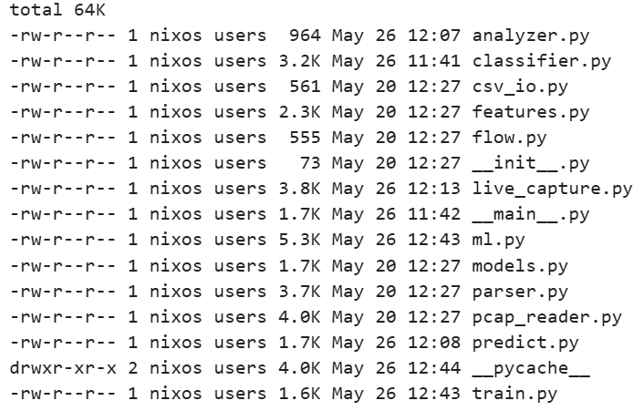

### 2.2 功能模块划分

#### 2.2.1 抓包与文件读取模块

对应文件：`traffic_classifier/pcap_reader.py` 和 `traffic_classifier/live_capture.py`。

`pcap_reader.py` 使用 Python 标准库读取 `.pcap` 和 `.pcapng` 文件，输出统一的 `RawPacket(timestamp, data)` 对象。`live_capture.py` 在 Linux 下通过 `AF_PACKET` 原始套接字抓取以太网帧，支持列出网卡、指定网卡、设置抓包数量和超时时间。

#### 2.2.2 协议解析模块

对应文件：`traffic_classifier/parser.py`。

该模块从原始以太网帧中解析：

1. Ethernet II 源 MAC、目的 MAC、类型字段。
2. 可选 VLAN 标签。
3. IPv4 源 IP、目的 IP、TTL、总长度、协议号。
4. TCP 源端口、目的端口、flags。
5. UDP 源端口、目的端口。
6. ICMP 类型字段。

解析成功后输出 `PacketRecord`，供后续流聚合和特征提取使用。

#### 2.2.3 五元组流聚合模块

对应文件：`traffic_classifier/flow.py` 和 `traffic_classifier/models.py`。

网络流使用五元组表示：

```text
源 IP、目的 IP、源端口、目的端口、传输层协议
```

项目使用 `FlowKey.from_packet()` 对端点进行排序，将同一连接的上下行数据包合并为一条双向流。例如：

```text
172.27.152.109:53209 <-> 202.114.200.251:53 UDP
```

这样可以避免客户端到服务器和服务器到客户端被拆成两条不同流。

#### 2.2.4 特征提取模块

对应文件：`traffic_classifier/features.py`。

每条流转换为一行特征数据：

| 特征 | 含义 |
| --- | --- |
| packet_count | 流内数据包数量 |
| total_bytes | 流内 IP 包总字节数 |
| avg_packet_size | 平均包长 |
| max_packet_size | 最大包长 |
| min_packet_size | 最小包长 |
| duration | 流持续时间 |
| avg_interval | 平均包到达间隔 |
| interval_variance | 包到达间隔方差 |
| avg_ttl | 平均 TTL |
| syn_count | TCP SYN 数量 |
| ack_count | TCP ACK 数量 |
| fin_count | TCP FIN 数量 |
| rst_count | TCP RST 数量 |
| psh_count | TCP PSH 数量 |
| unique_ports | 流中出现的不同端口数量 |

CSV 输出示例如下：

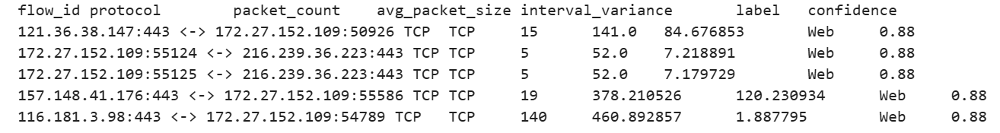

#### 2.2.5 分类与报警模块

对应文件：`traffic_classifier/classifier.py` 和 `traffic_classifier/ml.py`。

规则分类器使用透明规则识别基础流量：

| 类别 | 判断依据 |
| --- | --- |
| DNS | TCP/UDP 端口 53 |
| Web | TCP 端口 80 或 443 |
| ICMP | IP 协议号为 ICMP |
| SSH | TCP 端口 22 |
| Small_UDP | 小包、短 UDP 流 |
| SYN_Flood | SYN 数量多且 ACK 很少 |
| TCP_Probe | 短 TCP 探测流 |
| Port_Scan | 同一源目标对出现多个 TCP 探测端口 |
| Unknown | 无明显规则匹配 |

KNN 模型使用 `ml.py` 中的标准库实现，训练后保存为 JSON 文件，预测时根据归一化特征向量计算欧氏距离并进行近邻投票。

### 2.3 应用层协议与 TCP 粘包说明

本题目不是客户端-服务器聊天程序，而是网络流量分类器，因此系统本身没有自定义聊天应用层协议，也不存在业务通信中的 TCP 粘包处理。程序读取的是 Wireshark 捕获后的完整链路层帧，接收边界由 pcap/pcapng 文件记录提供。

如果对被分析的 HTTP/HTTPS 流量进行协议理解，则可以说明如下：

1. HTTP 是应用层协议，明文 HTTP 请求可在 TCP payload 中看到请求行、Header 和 Body。
2. HTTPS 中 HTTP 内容被 TLS 加密，抓包通常只能看到 TLS 记录、TCP/IP 头部、端口、包长和时间间隔。
3. 本项目主要利用端口、协议号、包长、TTL、TCP flags 和统计特征分类，不依赖读取 HTTP 明文内容。
4. 对于 TCP 被分析流量，Wireshark 和操作系统根据序号、确认号和流重组能力处理 TCP 字节流；本项目按单个捕获帧解析头部字段，不做应用层重组。

## 第 3 章 五层体系结构原理分析与验证

### 3.1 五层结构与项目字段对应

| 层次 | 原理 | 项目中的字段或现象 |
| --- | --- | --- |
| 应用层 | 浏览器生成 HTTP/HTTPS 请求，DNS 生成查询请求 | Web、DNS、ICMP 等分类标签 |
| 传输层 | TCP/UDP 提供端到端通信 | 源端口、目的端口、TCP flags |
| 网络层 | IP 负责跨网络转发 | 源 IP、目的 IP、TTL、协议号 |
| 链路层 | 同一链路内通过 MAC 地址传输帧 | 源 MAC、目的 MAC、EtherType |
| 物理层 | 比特流通过网线或无线信道传输 | Wireshark Frame 长度和捕获时间体现物理传输结果 |

Wireshark 五层字段截图如下：

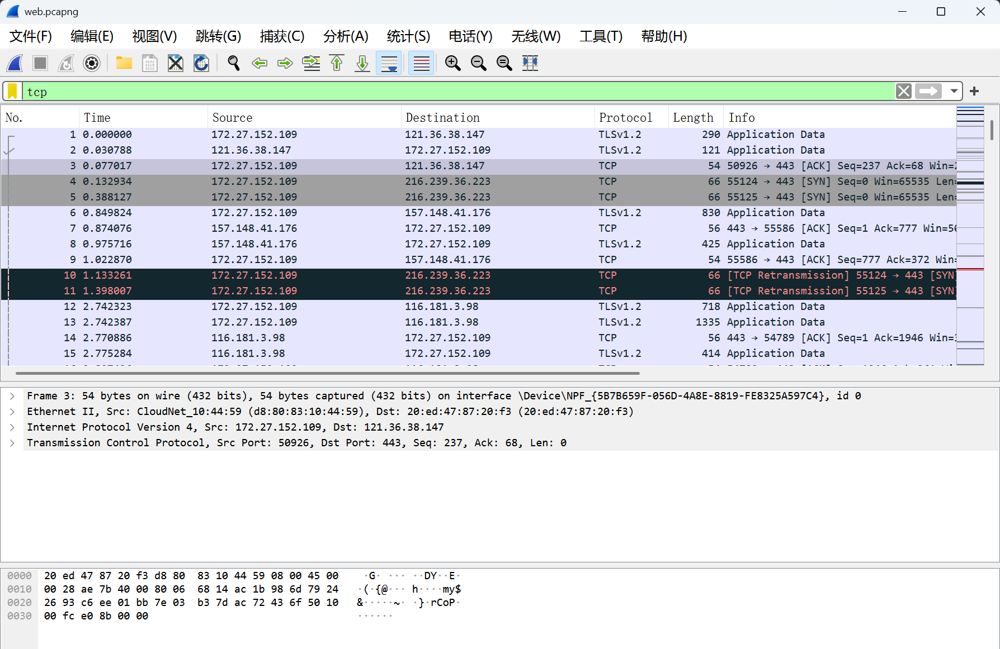

Web 过滤截图如下：

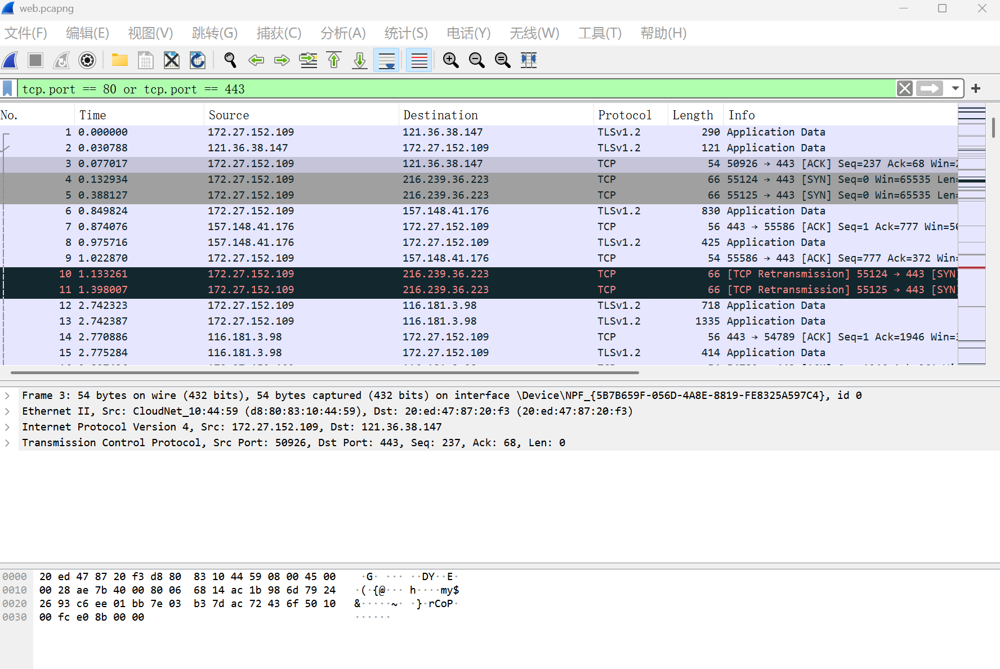

### 3.2 HTTP/HTTPS 请求的封装过程

以浏览器访问网站为例，浏览器首先在应用层生成 HTTP 请求。如果访问 HTTPS 网站，浏览器还会建立 TLS 会话，HTTP 明文会被加密成 TLS 记录。随后操作系统 TCP 协议栈添加 TCP 头部，包含源端口、目的端口、序号、确认号、窗口大小、校验和和 flags。IP 层继续添加 IPv4 头部，包含源 IP、目的 IP、TTL、总长度和协议号。链路层添加 Ethernet 头部，包含源 MAC、目的 MAC 和 EtherType。最后物理层将帧转换为比特流发送。

封装顺序：

```text
HTTP 请求或 TLS 应用数据
  -> TCP 头部 + 应用层数据
  -> IPv4 头部 + TCP 段
  -> Ethernet 头部 + IPv4 数据包
  -> 比特流
```

### 3.3 程序捕获与解析过程

Wireshark 保存的 pcap/pcapng 文件中包含捕获到的链路层帧。项目读取文件后按如下顺序解析：

1. `pcap_reader.py` 读取捕获文件，得到 `RawPacket`。
2. `parser.py` 先解析 Ethernet II 头部，判断 EtherType 是否为 IPv4。
3. 若存在 VLAN 标签，跳过 VLAN 头部后继续解析 IPv4。
4. IPv4 解析得到源 IP、目的 IP、TTL、协议号和总长度。
5. 根据协议号分别解析 TCP、UDP 或 ICMP。
6. TCP 解析源端口、目的端口和 flags；UDP 解析源端口和目的端口；ICMP 解析类型字段。
7. `flow.py` 将数据包归入双向五元组流。
8. `features.py` 把每条流转换为统计特征。
9. `classifier.py` 和 `ml.py` 输出类别、置信度和原因。

终端分析截图如下：

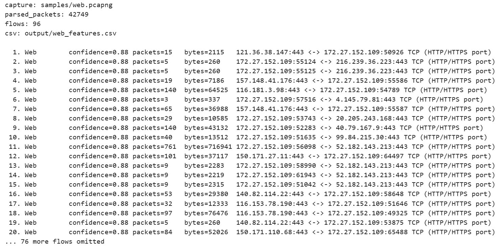

### 3.4 逐层验证说明

应用层方面，Web 流量通常表现为 TCP 80/443 端口。HTTPS 内容加密后无法直接查看 HTTP 明文，但可以通过 TCP 443、数据包长度、连接持续时间和包数量判断为 Web 流量。DNS 流量通常表现为 UDP/TCP 53，查询和响应包较短。ICMP 流量来自 ping 等连通性测试，不使用 TCP/UDP 端口。

传输层方面，程序解析 TCP/UDP 端口和 TCP flags。TCP SYN、ACK、FIN、RST、PSH 的数量可以反映连接建立、数据传输、连接释放和异常探测行为。UDP 头部较短，常用于 DNS 等短请求响应业务。

网络层方面，程序解析 IPv4 源 IP、目的 IP、TTL 和协议号。TTL 可用于观察路由转发过程中生存时间的变化；协议号 6 表示 TCP，17 表示 UDP，1 表示 ICMP。

链路层方面，程序解析 Ethernet 源 MAC、目的 MAC 和 EtherType。跨网段通信时，目的 MAC 通常是默认网关的 MAC，而不是远端服务器的 MAC，这体现了 IP 路由和链路层转发的区别。

物理层方面，程序不能直接处理电信号或无线电信号，但 Wireshark 的 Frame 信息记录了帧长度、捕获时间和接口信息，说明物理层传输后的帧已经被网卡捕获。

## 第 4 章 AI 集成实现

### 4.1 AI 方法选择

本题目中的 AI 集成采用本地机器学习模型，而不是调用云端大模型 API。课程要求允许训练简单模型，例如决策树或 KNN。本项目选择 KNN，原因如下：

1. KNN 算法直观，适合课程展示。
2. 可以用标准库实现，不依赖 scikit-learn。
3. 对少量自采样本可快速训练。
4. 预测结果可解释为“与训练样本中最相近的若干流量类别一致”。

为了保证演示稳定性，系统同时保留规则分类器。规则分类器负责给出基础标签和攻击报警；KNN 模型负责体现 AI/机器学习分类流程。

### 4.2 KNN 训练流程

训练入口对应文件：`traffic_classifier/train.py`。

训练流程：

```text
读取带标签 CSV
  -> 提取特征列
  -> 将协议类型转换为 one-hot 特征
  -> 计算每列均值和标准差
  -> 归一化训练样本
  -> 保存 k、特征列、均值、尺度和样本向量
  -> 输出 JSON 模型
```

训练命令：

```bash
python -m traffic_classifier.train output/dns_features.csv output/icmp_features.csv output/web_features.csv \
  --model models/knn_model.json
```

实际验证输出显示，使用 DNS、ICMP、Web 三类 CSV 训练时，共有 342 条样本，类别为 DNS、ICMP、Web，`k=3`。

KNN 训练截图如下：

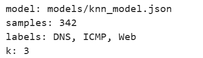

### 4.3 KNN 预测流程

预测入口对应文件：`traffic_classifier/predict.py`。

预测流程：

```text
读取 pcap/pcapng
  -> 解析协议字段
  -> 聚合五元组流
  -> 提取特征
  -> 加载 JSON 模型
  -> 归一化当前流特征
  -> 计算与训练样本的欧氏距离
  -> 选取 k 个近邻投票
  -> 输出 ML 标签和置信度
```

预测命令：

```bash
python -m traffic_classifier.predict samples/web.pcapng --model models/knn_model.json --limit 5
```

实际输出中，`samples/web.pcapng` 被解析出 42749 个包和 96 条流，前 5 条流的 ML 标签均为 Web，置信度为 1.00，规则标签也为 Web。

KNN 预测截图如下：

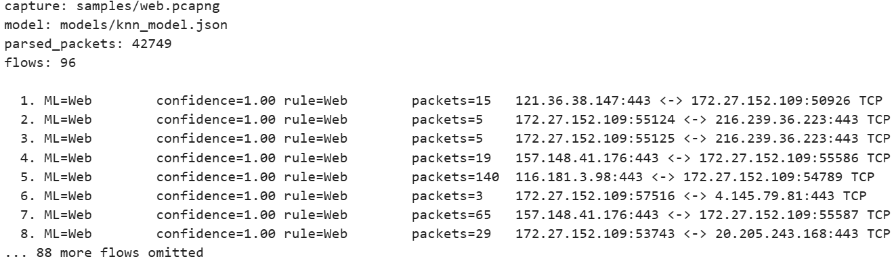

### 4.4 规则与 KNN 的结合

项目不是完全用 KNN 覆盖规则结果，而是做了稳健性处理：

1. 当规则分类置信度较高且 KNN 给出不同结果时，优先保留规则标签。
2. 当 KNN 置信度低于阈值时，回退到规则分类。
3. 对 Port_Scan 等攻击类标签，避免被普通 Web、DNS、ICMP 样本误覆盖。
4. 当规则分类为 Unknown 且 KNN 置信度较高时，使用 KNN 结果。

这种设计能同时满足“模型分类”和“结果可解释”的要求。

## 第 5 章 系统测试与验证

### 5.1 功能测试

在仓库根目录通过 `nix develop` 进入开发环境后，对项目进行窄范围验证。由于当前 Nix 环境未安装 `pytest`，无法直接运行 `pytest -q CPE/traffic_classifier/tests`；因此使用项目命令行入口和手写断言脚本完成等价验证。

手写断言覆盖内容包括：

1. Web 流能够被规则分类为 Web。
2. DNS 流能够被规则分类为 DNS。
3. SYN Flood 能够触发攻击标签。
4. 短 TCP 探测流能够触发 TCP_Probe。
5. 同一源目标对访问 5 个不同端口时能够标记为 Port_Scan。
6. KNN 模型能对已知 DNS 特征输出 DNS，置信度为 1.0。

断言脚本输出：

```text
manual pipeline assertions passed
```

### 5.2 样本分析测试

运行命令：

```bash
python -m traffic_classifier samples/web.pcapng --limit 5
```

实际结果：

```text
parsed_packets: 42749
flows: 96
前 5 条流均分类为 Web，confidence=0.88
```

运行命令：

```bash
python -m traffic_classifier samples/dns.pcapng --limit 5
```

实际结果：

```text
parsed_packets: 526
flows: 245
前 5 条流均分类为 DNS，confidence=0.92
```

运行命令：

```bash
python -m traffic_classifier samples/icmp.pcapng --limit 5
```

实际结果：

```text
parsed_packets: 8
flows: 1
分类为 ICMP，confidence=0.95
```

样本整体统计：

| 样本 | 解析包数 | 流数量 | 标签分布 |
| --- | ---: | ---: | --- |
| `dns.pcapng` | 526 | 245 | DNS: 245 |
| `icmp.pcapng` | 8 | 1 | ICMP: 1 |
| `web.pcapng` | 42749 | 96 | Web: 96 |
| `live_100.pcapng` | 105 | 19 | Web: 10，Unknown: 3，Small_UDP: 5，DNS: 1 |
| `false_positive_port_scan.pcap` | 5 | 5 | Port_Scan: 5 |

### 5.3 KNN 模型测试

训练命令：

```bash
python -m traffic_classifier.train output/dns_features.csv output/icmp_features.csv output/web_features.csv \
  --model /tmp/cpe_knn_model.json
```

实际输出：

```text
samples: 342
labels: DNS, ICMP, Web
k: 3
```

预测命令：

```bash
python -m traffic_classifier.predict samples/web.pcapng --model models/knn_model.json --limit 5
```

实际输出：

```text
parsed_packets: 42749
flows: 96
前 5 条流 ML=Web，confidence=1.00，rule=Web
```

### 5.4 攻击检测测试

运行端口扫描样本：

```bash
python -m traffic_classifier samples/false_positive_port_scan.pcap --limit 10
```

实际结果中 5 条流均输出 `ALERT Port_Scan`，置信度为 0.80，原因是同一源目标对出现了 5 个不同目的端口的 TCP 探测。

报警截图如下：

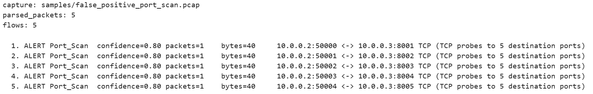

### 5.5 实时抓包测试

实时抓包入口：

```bash
python -m traffic_classifier.live_capture --count 100 --model models/knn_model.json
```

程序支持列出网卡、选择网卡、抓取指定数量数据包并分类。实际运行时 Linux 原始套接字通常需要 root 或 `CAP_NET_RAW` 权限。当前环境若权限不足，会提示：

```text
hint: live capture usually needs root or CAP_NET_RAW permission
```

因此报告中使用 `samples/live_100.pcapng` 作为 100 包抓取的离线等价展示。

实时抓包相关截图如下：

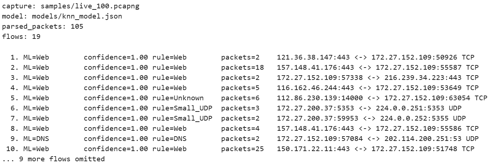

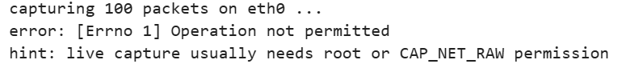

### 5.6 测试结论

测试表明，项目能够稳定读取 pcap/pcapng 样本，正确解析 TCP、UDP、ICMP 等常见协议，能按双向五元组聚合流并提取课程要求的关键特征。规则分类器对 DNS、ICMP、Web 样本输出稳定，KNN 模型能基于 342 条训练样本完成分类预测。攻击检测模块能够对端口扫描样本输出报警。实时抓包模块已实现，但在当前环境中受系统权限限制，需要 root 或 `CAP_NET_RAW` 后才能直接抓取网卡数据。

测试通过截图如下：

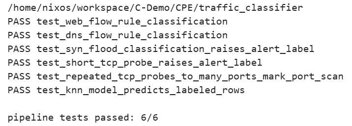

## 第 6 章 总结与展望

本题目完成了一个较完整的 AI 驱动网络流量分类器。系统从抓包文件读取开始，经过协议解析、五元组聚合、特征提取、规则分类、KNN 训练预测和报警输出，覆盖了课程设计要求中的抓包模块、特征提取模块、分类模块、实时抓包入口和五层体系结构分析。项目实现不依赖第三方 Python 包，便于在受限环境中运行和展示。

本项目的主要成果包括：

1. 支持 pcap/pcapng 文件读取和 Linux 实时抓包入口。
2. 支持 Ethernet、IPv4、TCP、UDP、ICMP 解析。
3. 能提取平均包长、到达间隔方差、协议、端口、TTL、TCP flags 等特征。
4. 能使用规则分类器识别 Web、DNS、ICMP 等常见流量。
5. 能使用标准库 KNN 模型完成训练、保存、加载和预测。
6. 能检测 SYN Flood、TCP Probe、Port Scan 等攻击流量并报警。
7. 能结合 Wireshark 截图解释 HTTP/HTTPS 请求在五层结构中的封装过程。

后续可从以下方向改进：

1. 引入更大规模公开数据集，例如 UNSW-NB15 或 ISCX VPN-nonVPN，提升模型泛化能力。
2. 在保证可解释性的基础上尝试决策树、随机森林等模型。
3. 增加实时图形化界面，以柱状图或时间序列展示流量类别变化。
4. 增加 TCP 流重组和 DNS/HTTP 应用层字段解析能力。
5. 针对校园网实际流量持续采集和标注，微调模型并降低误报率。
