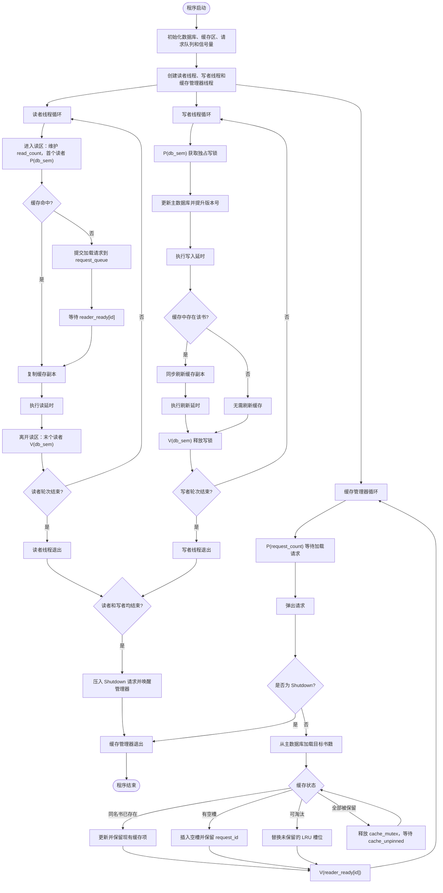

# 共享电子书数据库并发访问控制系统设计文档

## 1. 项目概述

本项目用于完成《操作系统原理课程设计》题目一和题目二。系统模拟一个在线图书馆的共享电子书数据库，支持多个读者线程并发读取、多个写者线程独占写入，并引入有界缓存区减少对主数据库的直接访问压力。

题目一在 Linux 用户态使用 C++、pthread 和 POSIX semaphore 实现线程同步与互斥。题目二在题目一基础上，将读、写、缓存加载、缓存刷新所用的随机延时函数改造为 Linux 系统调用形式，并在用户程序中调用。

项目目录规划如下：

```text
OS/library_cache_sync/
├── docs/
│   ├── 设计文档.md
│   ├── 课设题目.md
│   ├── diag_syscall_design.md
│   ├── 运行用例分析.md
│   └── 题目二逐步操作.md
├── Makefile
├── include/
│   ├── common.h
│   ├── database.h
│   ├── cache.h
│   ├── request_queue.h
│   └── simulator.h
├── src/
│   ├── main.cpp
│   ├── database.cpp
│   ├── cache.cpp
│   ├── request_queue.cpp
│   ├── simulator.cpp
│   └── delay.cpp
└── syscall/
    └── user_call_demo.cpp
```

当前设计文档明确总体方案、同步规则、数据结构、线程流程、系统调用改造方式和验收测试计划；实现代码已按上述模块拆分，避免把全部逻辑堆在 `main.cpp` 中。

## 2. 需求分析

### 2.1 功能需求

1. 支持固定数量的读者线程和写者线程，例如 8 个读者、3 个写者。
2. 每个读者线程循环执行若干次读操作，例如 5 次。
3. 每个写者线程循环执行若干次写操作，例如 5 次。
4. 多个读者在没有写者写入时可以并发读取。
5. 写者写入时必须独占数据库资源，期间禁止其他读者和写者访问。
6. 系统维护大小为 `N` 的有界缓存区，例如 `N = 5`。
7. 读者读取前先检查缓存。
8. 缓存命中时，读者直接读取缓存副本。
9. 缓存未命中时，读者提交加载请求，等待缓存管理器将书籍从主数据库加载到缓存，然后再读取缓存副本。
10. 写者更新主数据库后，如果缓存中存在对应书籍，必须同步刷新缓存副本。
11. 所有关键步骤打印清晰日志，便于观察线程交错执行顺序。
12. 题目二要求把模拟耗时的随机延时函数替换为自定义 Linux 系统调用。

### 2.2 约束需求

1. 使用 C/C++/C++ STL，核心同步必须体现 P/V 操作。
2. 使用 Linux pthread 创建和管理线程。
3. 除模拟读、写、加载、刷新耗时外，缓存数组、请求队列、标志位等结构必须真实操作。
4. 设计必须避免死锁，尤其避免在持有互斥信号量时等待其他线程完成长期操作。
5. 代码应按功能模块拆分，便于解释和验收。
6. 报告材料需要覆盖实验过程、功能正确性、结果分析和设计优化点。

## 3. 总体架构

系统分为五个核心模块：

| 模块 | 职责 |
| --- | --- |
| 主数据库模块 | 保存所有电子书的真实内容和版本号，模拟数据库读写 |
| 缓存区模块 | 保存最近加载或刷新过的书籍副本，提供命中查询、插入、更新和淘汰 |
| 请求队列模块 | 保存读者缓存 miss 后提交的加载请求，供缓存管理器处理 |
| 线程模拟模块 | 创建读者、写者、缓存管理器线程，控制循环次数和日志 |
| 延时模块 | 封装 sleep1、sleep2、sleep3、sleep4；题目二中替换为系统调用 |

整体流程如下：

```text
读者线程
  ├── 进入读者优先读区
  ├── 查询缓存
  │   ├── 命中：读取缓存副本
  │   └── 未命中：提交加载请求，等待缓存管理器完成加载，再读取缓存
  └── 离开读区

写者线程
  ├── 获取数据库写锁
  ├── 更新主数据库
  ├── 刷新缓存中对应副本
  └── 释放数据库写锁

缓存管理器线程
  ├── 等待加载请求
  ├── 从主数据库读取目标书籍
  ├── 写入或替换缓存槽
  └── 通知对应读者继续读取
```

核心运行流程图如下，可直接在支持 Mermaid 的 Markdown 编辑器中渲染：



## 4. 同步设计

### 4.1 信号量与共享变量

| 名称 | 初值 | 类型 | 作用 |
| --- | ---: | --- | --- |
| `db_sem` | 1 | `sem_t` | 数据库写锁。第一个读者进入时 P，最后一个读者离开时 V；写者写入时独占 P/V |
| `read_mutex` | 1 | `sem_t` | 保护 `read_count` |
| `read_count` | 0 | `int` | 当前处于读区的读者数量 |
| `cache_mutex` | 1 | `sem_t` | 保护缓存数组、缓存版本号和淘汰状态 |
| `empty_slots` | N | `sem_t` | 缓存区未占用槽位数量，首次插入新书时执行 P/V |
| `full_slots` | 0 | `sem_t` | 缓存区已占用槽位数量，用于体现有界缓存的生产者-消费者容量变化 |
| `cache_unpinned` | 0 | `sem_t` | 当缓存已满且所有槽位都被读者保留时，缓存管理器等待可淘汰槽位 |
| `request_mutex` | 1 | `sem_t` | 保护加载请求队列 |
| `request_count` | 0 | `sem_t` | 请求队列中待处理请求数量，缓存管理器在此等待 |
| `reader_ready[M]` | 0 | `sem_t[]` | 每个读者一个完成通知，缓存管理器加载完成后唤醒对应读者 |
| `log_mutex` | 1 | `sem_t` | 串行化日志输出，避免多线程日志互相穿插 |

本设计没有使用单个全局书名变量传递请求，而是使用受保护的请求队列。这样可以避免多个读者同时 miss 时覆盖同一个全局书名，也便于缓存管理器准确唤醒对应读者。

### 4.2 读者优先策略

读者优先由 `read_count + db_sem` 实现：

1. 读者进入前先 P(`read_mutex`)。
2. 如果 `read_count == 0`，说明当前读者是第一个读者，需要 P(`db_sem`) 阻止写者进入。
3. `read_count++` 后 V(`read_mutex`)。
4. 读者完成整个读取流程后，再 P(`read_mutex`)。
5. `read_count--`。
6. 如果 `read_count == 0`，说明最后一个读者离开，需要 V(`db_sem`) 允许写者进入。
7. V(`read_mutex`)。

该策略满足题目中的读者优先要求：只要已有读者在读，写者必须等待；多个读者可以并发进入读区。

需要注意的是，严格读者优先可能导致写者饥饿。如果验收需要展示优化点，可增加 `turnstile` 或 `waiting_writers` 机制实现公平读写，但基础实现先按题目要求保持读者优先。

### 4.3 写者独占策略

写者线程执行写操作前必须 P(`db_sem`)，写完主数据库并刷新缓存后再 V(`db_sem`)。由于第一个读者进入时也会持有 `db_sem`，因此写者不会与任何读者并发访问主数据库逻辑区。

写者刷新缓存时还需要 P(`cache_mutex`)。锁顺序固定为：

```text
写者：db_sem -> cache_mutex
读者：读者计数获取 db_sem -> cache_mutex
```

所有线程都不允许在持有 `cache_mutex` 时等待读者通知或请求完成，避免形成循环等待。

### 4.4 缓存 miss 同步

读者发现缓存未命中后执行以下步骤：

1. 释放 `cache_mutex`。
2. P(`request_mutex`)。
3. 将 `{reader_id, book_name, request_id}` 推入请求队列。
4. V(`request_mutex`)。
5. V(`request_count`) 通知缓存管理器。
6. P(`reader_ready[reader_id]`) 等待目标书籍加载完成。
7. 再次 P(`cache_mutex`) 查询缓存，将目标书籍副本复制到读者本地变量。
8. 释放该请求对缓存槽位的保留标记，然后 V(`cache_unpinned`)。
9. V(`cache_mutex`) 后执行模拟读取耗时。

缓存管理器执行以下步骤：

1. P(`request_count`) 等待请求。
2. P(`request_mutex`) 从队列弹出一个请求。
3. V(`request_mutex`)。
4. 从主数据库读取目标书籍并模拟加载耗时。
5. P(`cache_mutex`)。
6. 将书籍插入缓存，并为对应 `request_id` 增加保留标记；若缓存已满，只允许淘汰未被保留的 LRU 槽位。
7. 如果缓存已满且所有槽位都被保留，则 V(`cache_mutex`)，P(`cache_unpinned`) 后重试。
8. V(`cache_mutex`)。
9. V(`reader_ready[reader_id]`) 唤醒对应读者。

这种方式把“请求等待”和“缓存结构互斥”分离，读者不会持有缓存锁等待缓存管理器，缓存管理器也不会持有请求锁进行耗时加载。

### 4.5 有界缓存区容量控制

缓存区是大小为 `N` 的真实有界数组。由于题目场景是“最近访问的电子书副本”，读者读取缓存后不会删除副本；这里的“释放槽位”设计为释放读者对该缓存项的临时保留，而不是把缓存项置空。

容量信号量按以下规则使用：

1. 缓存管理器首次把一本新书插入空槽时，先 P(`empty_slots`)，插入成功后 V(`full_slots`)。
2. 写者刷新已有缓存副本不改变槽位数量，不操作 `empty_slots/full_slots`。
3. 缓存已满时加载新书，直接覆盖一个未被保留的 LRU 槽位，`empty_slots/full_slots` 的计数不变。
4. 如果所有槽位都被读者保留，缓存管理器等待 `cache_unpinned`，直到至少一个读者完成复制并释放保留。

这样既保留缓存“副本池”的语义，又体现有界缓冲区的生产者-消费者容量控制。

## 5. 数据结构设计

### 5.1 电子书结构

```cpp
struct Book {
    std::string name;
    std::string content;
    int version;
};
```

`version` 用于验证写者更新后读者是否读到了新版本。每次写者更新某本书，主数据库中的 `version` 加 1，缓存中对应副本也刷新为相同版本。

### 5.2 主数据库

```cpp
class Database {
public:
    Book readBook(const std::string& name) const;
    Book writeBook(const std::string& name, int writer_id);
    std::vector<std::string> allBookNames() const;

private:
    std::unordered_map<std::string, Book> books_;
};
```

主数据库初始化时放入若干本书，例如：

```text
OS
Linux
Database
Compiler
Network
Security
Algorithm
```

读者随机选择一本书读取，写者随机选择一本书更新。写者更新内容可记录为：

```text
updated by writer <id>, version <version>
```

### 5.3 缓存区

```cpp
struct CacheEntry {
    bool valid;
    Book book;
    unsigned long last_access_tick;
    std::set<int> pinned_request_ids;
};

class Cache {
public:
    bool findAndCopy(const std::string& name, Book& out);
    bool findPinnedAndCopy(const std::string& name, int request_id, Book& out);
    bool contains(const std::string& name) const;
    bool hasFreeSlot() const;
    bool updateExistingAndPin(const Book& book, int request_id);
    void insertIntoFreeSlotAndPin(const Book& book, int request_id);
    bool replaceLruAndPin(const Book& book, int request_id);
    void releasePin(const std::string& name, int request_id);
    bool updateIfPresent(const Book& book);
    std::string snapshot() const;

private:
    std::vector<CacheEntry> slots_;
    unsigned long tick_;
};
```

缓存容量为 `N`。当缓存管理器加载书籍时：

1. 如果同名书已存在，`updateExistingAndPin` 直接更新内容和版本，并把 `request_id` 加入 `pinned_request_ids`，返回 `true`。
2. 如果有空槽，先 P(`empty_slots`)，再由 `insertIntoFreeSlotAndPin` 插入空槽，并把 `request_id` 加入 `pinned_request_ids`，最后 V(`full_slots`)。
3. 如果缓存已满，`replaceLruAndPin` 淘汰 `last_access_tick` 最小且 `pinned_request_ids` 为空的条目，即未被读者保留的 LRU 条目。
4. 如果所有条目都被保留，则等待读者释放保留后再重试。

题目说明缓存区保存最近访问的电子书副本，LRU 比简单 FIFO 更符合“最近访问”的语义，也可作为设计优化点。

### 5.4 请求队列

```cpp
struct LoadRequest {
    enum Type { Normal, Shutdown } type;
    int reader_id;
    std::string book_name;
    int request_id;
};

class RequestQueue {
public:
    void push(const LoadRequest& req);
    bool pop(LoadRequest& req);

private:
    std::queue<LoadRequest> queue_;
};
```

请求队列由 `request_mutex` 保护，待处理请求数量由 `request_count` 表示。`reader_id` 用于缓存管理器完成加载后唤醒对应读者。主线程结束时压入 `Shutdown` 类型请求，避免用未受保护的全局布尔变量控制缓存管理器退出。

## 6. 线程流程设计

### 6.1 读者线程流程

```text
reader_thread(reader_id):
    repeat ROUNDS times:
        book_name = 随机选择目标书籍
        log("[Reader] 请求读取 book_name")

        P(read_mutex)
        if read_count == 0:
            P(db_sem)
        read_count++
        V(read_mutex)

        copied = false
        while not copied:
            P(cache_mutex)
            if cache.findAndCopy(book_name, book):
                log("[Reader] 缓存命中，复制缓存副本 book_name version")
                copied = true
                V(cache_mutex)
            else:
                log("[Reader] 缓存未命中，提交加载请求")
                V(cache_mutex)

                request_id = nextRequestId()
                P(request_mutex)
                request_queue.push({Normal, reader_id, book_name, request_id})
                V(request_mutex)
                V(request_count)

                P(reader_ready[reader_id])

                P(cache_mutex)
                if cache.findPinnedAndCopy(book_name, request_id, book):
                    cache.releasePin(book_name, request_id)
                    V(cache_unpinned)
                    log("[Reader] 加载完成后复制缓存副本 book_name version")
                    copied = true
                else:
                    log("[Reader] 加载完成但缓存副本不存在，重新检查缓存")
                V(cache_mutex)

        delay_read()

        P(read_mutex)
        read_count--
        if read_count == 0:
            V(db_sem)
        V(read_mutex)
```

读者等待缓存管理器期间已经释放了 `cache_mutex` 和 `request_mutex`，所以不会阻塞缓存管理器处理请求。

### 6.2 缓存管理器线程流程

```text
cache_manager_thread():
    while true:
        P(request_count)

        P(request_mutex)
        req = request_queue.pop()
        V(request_mutex)

        if req.type == Shutdown:
            break

        log("[CacheManager] 开始加载 req.book_name")
        book = database.readBook(req.book_name)
        delay_load()

        while true:
            P(cache_mutex)
            if cache.updateExistingAndPin(book, req.request_id):
                log("[CacheManager] 已更新并保留现有缓存项 req.book_name version")
                V(cache_mutex)
                break
            if cache.hasFreeSlot():
                V(cache_mutex)
                P(empty_slots)
                P(cache_mutex)
                cache.insertIntoFreeSlotAndPin(book, req.request_id)
                V(full_slots)
                log("[CacheManager] 已加载到空槽 req.book_name version")
                V(cache_mutex)
                break
            if cache.replaceLruAndPin(book, req.request_id):
                log("[CacheManager] 已替换未保留槽位 req.book_name version")
                V(cache_mutex)
                break
            V(cache_mutex)
            P(cache_unpinned)

        V(reader_ready[req.reader_id])
```

缓存管理器是后台守护线程。主线程等待所有读者和写者结束后，向请求队列压入一个 `Shutdown` 请求，再 V(`request_count`) 唤醒缓存管理器退出。退出请求和普通请求使用同一个队列与同一把 `request_mutex`，避免数据竞争。

### 6.3 写者线程流程

```text
writer_thread(writer_id):
    repeat ROUNDS times:
        book_name = 随机选择目标书籍
        log("[Writer] 请求写入 book_name")

        P(db_sem)

        log("[Writer] 开始更新主数据库 book_name")
        book = database.writeBook(book_name, writer_id)
        delay_write()

        need_refresh_delay = false
        P(cache_mutex)
        if cache.updateIfPresent(book):
            log("[Writer] 已更新缓存副本结构 book_name version")
            need_refresh_delay = true
        else:
            log("[Writer] 缓存中无该书副本，无需刷新")
            need_refresh_delay = false
        V(cache_mutex)

        if need_refresh_delay:
            delay_refresh()

        V(db_sem)
```

写者先更新主数据库，再刷新缓存。刷新缓存时只更新已存在副本，不强制插入不存在的书；如果缓存中没有该书副本，则不执行刷新延时。缓存数组更新在 `cache_mutex` 内完成，模拟刷新耗时在释放 `cache_mutex` 后执行；写者仍持有 `db_sem`，因此刷新完成前不会有读者进入读区读取旧副本。

## 7. 延时与系统调用设计

### 7.1 用户态延时封装

题目一中先提供四个延时函数：

```cpp
void delay_read(long long student_no);
void delay_load(long long student_no);
void delay_write(long long student_no);
void delay_refresh(long long student_no);
```

用户态基础版本使用 `std::mt19937` 和 `std::this_thread::sleep_for` 或 `usleep` 生成 1000 到 5000 毫秒随机等待。四个函数使用不同偏移种子，避免每类操作延时完全相同。

```text
delay_read:    seed = student_no + 1
delay_load:    seed = student_no + 2
delay_write:   seed = student_no + 3
delay_refresh: seed = student_no + 4
```

### 7.2 题目二系统调用改造

题目二不使用普通用户态 `sleep` 函数替代，而是在 Linux 内核中新增系统调用。题目中 `diag(int number)` 的含义是：系统调用入口接收学号参数，以该参数为随机数种子，生成 1000 到 5000 毫秒之间的随机等待时间，并让当前进程睡眠。当前学号 `20241001655` 超过 32 位 `int` 范围，因此用户态使用 `long long student_no`，内核侧建议使用 `long number`。

主方案注册四个真正的 Linux 系统调用，分别对应题目一中的四类模拟耗时操作：

```c
sys_diag_read(number)
sys_diag_load(number)
sys_diag_write(number)
sys_diag_refresh(number)
```

四个入口内部复用同一个内核辅助函数：

```c
static long diag_delay_impl(long number, int op_offset);
```

`op_offset` 用于区分读、加载、写、刷新四类操作，使四类延时不会完全相同。用户态仍保留 `delay_read/load/write/refresh` 四个包装函数，分别通过 `syscall(__NR_diag_read, number)`、`syscall(__NR_diag_load, number)`、`syscall(__NR_diag_write, number)` 和 `syscall(__NR_diag_refresh, number)` 调用对应 Linux 系统调用。

如果验收时要求展示统一的 `diag(int number)` 名称，可解释题目原文使用 `int` 表述；由于当前学号为 11 位，实际实现使用 `long/long long` 避免溢出，但核心实现仍然是新增 Linux 系统调用，不退化为普通用户态函数。

### 7.3 内核改造记录要求

题目二涉及内核编译，设计上需要保留以下实验痕迹：

1. 新增系统调用实现文件或函数位置截图。
2. 系统调用表注册截图。
3. 系统调用号宏定义截图。
4. 内核编译成功截图。
5. 用户态测试程序调用 `diag` 或四个包装函数的输出截图。
6. 题目一程序切换到系统调用延时后的运行日志截图。

报告中说明：如果课程环境不允许真实修改运行内核，应在可控虚拟机或课程指定 Linux 内核源码环境中完成，不在本仓库中提交大型内核源码和编译产物，避免超过 8M 资料限制。

## 8. 日志设计

日志需要能直接观察同步关系，建议统一格式：

```text
[time=000123ms] [Reader-02] request book=Linux
[time=000125ms] [Reader-02] cache miss book=Linux, enqueue load request
[time=000126ms] [CacheManager] load begin book=Linux for reader=2
[time=001532ms] [CacheManager] load done book=Linux version=1 cache=[Linux:v1, OS:v2]
[time=001533ms] [Reader-02] read after load book=Linux version=1
[time=002010ms] [Writer-01] wait write book=OS
[time=002500ms] [Writer-01] update database book=OS version=3
[time=002510ms] [Writer-01] refresh cache book=OS version=3
```

日志输出由 `log_mutex` 保护，避免多个线程同时写 `std::cout` 导致内容交错。

## 9. 死锁规避策略

本项目涉及多个信号量，必须固定以下原则：

1. 不在持有 `cache_mutex` 时等待 `reader_ready`。
2. 不在持有 `request_mutex` 时执行数据库读取或 sleep。
3. 不在持有 `cache_mutex` 时执行读、加载、写、刷新等模拟耗时操作；`cache_mutex` 内只做数组查询、复制、插入、淘汰、版本更新等真实结构操作。
4. 写者固定按 `db_sem -> cache_mutex` 获取锁。
5. 读者通过 `read_count` 进入读区后，短时间获取 `cache_mutex` 查询或复制缓存。
6. 缓存管理器只在修改缓存数组时持有 `cache_mutex`。
7. 所有日志输出只短暂持有 `log_mutex`，日志函数内部不再获取其他业务锁。

重点避免如下错误：

```text
读者持有 cache_mutex 等待缓存管理器加载
缓存管理器需要 cache_mutex 才能写入缓存
```

该错误会导致读者和缓存管理器互相等待。本设计要求读者提交请求前释放 `cache_mutex`。

## 10. 正确性说明

### 10.1 读者并发正确性

第一个读者进入时获取 `db_sem`，后续读者只增加 `read_count`，因此多个读者可以同时处于读区。最后一个读者离开时释放 `db_sem`，写者才能进入。

### 10.2 写者独占正确性

写者必须获取 `db_sem` 才能更新主数据库。读者存在时 `db_sem` 被读者集合持有；其他写者存在时 `db_sem` 也被占用。因此写者不会与读者或其他写者并发执行写区。

### 10.3 缓存一致性正确性

写者更新主数据库后，在释放 `db_sem` 前刷新缓存中已有副本。由于此时没有读者处于读区，读者不会在主数据库版本更新和缓存副本刷新之间读到旧缓存。后续读者读取缓存时，缓存版本与主数据库对应书籍版本一致。

### 10.4 缓存加载正确性

读者缓存 miss 后提交包含 `reader_id` 和 `request_id` 的请求。缓存管理器加载完成后，为该请求在缓存项上增加保留标记，再唤醒对应读者。读者被唤醒后复制该缓存副本并释放保留标记，因此目标副本不会在读者真正复制前被 LRU 淘汰。

## 11. 测试与验收计划

### 11.1 编译验证

后续实现完成后，使用仓库约定的局部编译方式验证：

```bash
make -C OS/library_cache_sync
```

如暂未编写 Makefile，也可直接编译：

```bash
clang++ -std=c++17 -pthread OS/library_cache_sync/src/*.cpp -I OS/library_cache_sync/include -o /tmp/library_cache_sync
```

### 11.2 基础运行用例

```bash
./build/library_cache_sync --readers 8 --writers 3 --cache-size 5 --rounds 5 --student-no 20241001655
```

观察点：

1. 日志中允许多个读者连续进入读区。
2. 写者开始写入后，写者完成前不应出现读者读取日志。
3. 同一时间只允许一个写者写入。
4. 缓存 miss 后必须出现缓存管理器加载日志。
5. 读者等待加载完成后才能读取该书。
6. 写者更新某书后，如果缓存有该书，缓存版本号同步更新。
7. 程序最终所有读者、写者、缓存管理器线程正常退出。

### 11.3 边界用例

| 用例 | 参数 | 期望结果 |
| --- | --- | --- |
| 单读者无写者 | `readers=1 writers=0` | 可正常读取，缓存 miss 被加载 |
| 多读者无写者 | `readers=8 writers=0` | 多读者并发读取，无写锁等待 |
| 无读者多写者 | `readers=0 writers=3` | 写者逐个独占写入 |
| 缓存容量为 1 | `cache-size=1` | 频繁淘汰但不越界、不死锁 |
| 大量 miss | 初始空缓存、书籍数量大于缓存 | 请求队列稳定处理 |
| 写缓存命中书 | 写者更新已缓存书籍 | 缓存版本同步刷新 |

### 11.4 系统调用验证

内核侧系统调用改造完成后增加：

```bash
./build/user_call_demo 20241001655
```

验证点：

1. `diag(number)` 返回前等待 1000 到 5000 毫秒。
2. 多次调用延时范围正确。
3. 题目一程序切换到 syscall 延时后仍能正常运行。
4. 报告中保留系统调用注册、编译和运行截图。

## 12. 评分点映射

| 评分项 | 本设计对应内容 |
| --- | --- |
| 实验基本操作 | pthread 创建线程、sem_t 实现 P/V、Makefile 局部构建 |
| 实验功能正确 | 读者优先、写者独占、缓存 miss 加载、写后缓存刷新 |
| 实验设计优化 | 请求队列替代单全局书名变量、读者专属通知、缓存项保留标记、LRU 缓存淘汰、重复 miss 合并和公平读写可扩展方案 |
| 报告内容充实 | 需求、架构、数据结构、流程、同步、死锁规避、测试计划 |
| 实验结果分析 | 通过日志版本号和线程交错顺序分析正确性 |
| 报告格式规范 | 可按课程设计报告模板将本文整理为正文内容 |

## 13. 实现完成情况

1. 已编写 `include/` 和 `src/` 中的核心模块。
2. 已添加 `Makefile`，使用 `clang++ -std=c++17 -pthread` 局部编译。
3. 已实现用户态延时版本，可完成题目一功能验证。
4. 已添加命令行参数，支持读者数、写者数、缓存容量、循环次数、学号、延时范围和随机种子。
5. 已提供典型运行日志输出，可用于报告结果分析。
6. 已添加 `syscall/user_call_demo.cpp` 和 `docs/diag_syscall_design.md`，用于题目二内核改造后的用户态验证。
7. 题目二的 Linux 内核源码修改、内核编译和截图仍需在虚拟机或课程指定环境完成，本仓库不提交大型内核源码和编译产物。

## 14. 可优化点与实现建议

当前设计已经比题目给出的参考伪代码更稳健，主要优化点是：用请求队列替代单个全局书名变量、用 `reader_id + request_id` 精确唤醒读者、用缓存项保留标记避免刚加载的数据被淘汰、用 LRU 体现“最近访问”语义。这些内容可直接写入报告的“实验设计优化”部分。

仍可继续优化的点如下：

1. 重复 miss 合并：多个读者同时请求同一本未缓存书籍时，可以用 `loading_books[book_name]` 记录正在加载的书，把后续读者挂到等待列表中，避免缓存管理器重复读取主数据库。基础版本也必须先检查同名缓存项，再执行 P(`empty_slots`)，否则重复请求可能导致 `empty_slots/full_slots` 计数与真实缓存槽数量不一致。
2. 写者饥饿控制：严格读者优先满足题目要求，但连续读者可能让写者长时间等待。若需要展示公平性优化，可增加 `turnstile` 信号量或 `waiting_writers` 计数，使已有读者读完后优先放行等待写者。
3. 日志与业务锁分离：日志输出较慢，实现时可在业务锁内只生成状态快照，释放不影响一致性的业务锁后再打印，减少锁持有时间；写者在缓存刷新完成前仍需持有 `db_sem`。
4. 缓存等待通知精确化：`cache_unpinned` 可只在某个缓存项的保留集合从非空变为空时发送通知，避免累积无效唤醒。基础版本每次释放 pin 都 V(`cache_unpinned`) 也能工作，但可能产生额外重试。
5. 系统调用兼容包装：题目二原文提到 `diag(int number)`，但当前学号 `20241001655` 超过 32 位 `int` 范围，因此实际实现应使用 `long/long long` 参数。实现时可保留四个内部包装 `delay_read/load/write/refresh`，统一调用四个系统调用入口。这样既能解释题目表述，也能保持题目一代码结构清晰。
6. 验收参数可配置：读者数、写者数、缓存容量、循环次数、学号、随机种子通过命令行传入，便于演示边界用例和复现实验日志。
